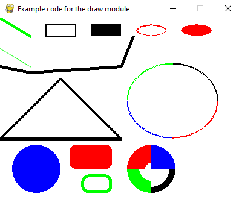

.. include:: common.txt

:mod:`pygame.draw`
==================

.. module:: pygame.draw
   :synopsis: pygame module for drawing shapes

| :sl:`pygame module for drawing shapes`

Draw several simple shapes to a surface. These functions will work for
rendering to any format of surface. Rendering to hardware surfaces will be
slower than regular software surfaces.

Most of the functions take a width argument to represent the size of stroke
(thickness) around the edge of the shape. If a width of 0 is passed the shape
will be filled (solid).

All the drawing functions respect the clip area for the surface and will be
constrained to that area. The functions return a rectangle representing the
bounding area of changed pixels. This bounding rectangle is the 'minimum'
bounding box that encloses the affected area.

All the drawing functions accept a color argument that can be one of the
following formats:

   - a :mod:`pygame.Color` object
   - an ``(RGB)`` triplet (tuple/list)
   - an ``(RGBA)`` quadruplet (tuple/list)
   - an integer value that has been mapped to the surface's pixel format
     (see :func:`pygame.Surface.map_rgb` and :func:`pygame.Surface.map_rgb`).

A color's alpha value will be written directly into the surface (if the
surface contains pixel alphas), but the draw function will not draw
transparently.

These functions temporarily lock the surface they are operating on. Many
sequential drawing calls can be sped up by locking and unlocking the surface
object around the draw calls (see :func:`pygame.Surface.lock` and
:func:`pygame.Surface.lock`).

.. function:: rect

   | :sl:`draw a rectangle`
   | :sg:`rect(surface=Surface, color=Color, rect=Rect) -> Rect`
   | :sg:`rect(surface=Surface, color=Color, rect=Rect, width=0) -> Rect`

   Draws a rectangle on the given surface.

   :param Surface surface: surface to draw on
   :param color: color to draw with, the alpha value is optional if using a
      tuple ``(RGB[A])``
   :type color: Color or int or tuple(int, int, int, [int])
   :param Rect rect: rectangle to draw, position and dimensions
   :param int width: (optional) used for line thickness or to indicate that
      the rectangle is to be filled (not to be confused with the width value
      of the ``rect`` parameter)

         | if width == 0, (default) fill the rectangle
         | if width > 0, used for line thickness
         | if width < 0, nothing will be drawn
         |

         .. note::
            When using ``width`` values ``> 1``, the edge lines will grow
            outside the original boundary of the ``rect``.

            For odd ``width`` values, the thickness of each edge line
            grows with the original line being in the center.

            For even ``width`` values, the thickness of each edge
            line grows with the original line being offset from the center
            (as there is no exact center line drawn). As a result,
            horizontal edge lines have 1 more pixel of thickness below the
            original line and vertical edge lines have 1 more pixel of
            thickness to the right of the original line.

   :returns: a rect bounding the changed pixels, if nothing is drawn the
      bounding rect's position will be the position of the given ``rect``
      parameter and its width and height will be 0
   :rtype: Rect

   .. note::
      The :func:`pygame.Surface.fill()` method works just as well for drawing
      filled rectangles and can be hardware accelerated on some platforms with
      both software and hardware display modes.

   .. versionchanged:: 2.0.0 Added support for keyword arguments.

   .. ## pygame.draw.rect ##

.. function:: polygon

   | :sl:`draw a polygon`
   | :sg:`polygon(surface, color, points) -> Rect`
   | :sg:`polygon(surface, color, points, width=0) -> Rect`

   Draws a polygon on the given surface.

   :param Surface surface: surface to draw on
   :param color: color to draw with, the alpha value is optional if using a
      tuple ``(RGB[A])``
   :type color: Color or int or tuple(int, int, int, [int])
   :param points: a sequence of 3 or more points that make up the vertices of
      the polygon, each point/vertex must be a tuple/list of 2 numbers
   :type points: tuple or list
   :param int width: (optional) used for line thickness or to indicate that
      the polygon is to be filled

         | if width == 0, (default) fill the polygon
         | if width > 0, used for line thickness
         | if width < 0, nothing will be drawn
         |

         .. note::
            When using ``width`` values ``> 1``, the edge lines will grow
            outside the original boundary of the polygon. For more details on
            how the thickness for edge lines grow, refer to the ``width`` notes
            for :func:`rect`.

   :returns: a rect bounding the changed pixels, if nothing is drawn the
      bounding rect's position will be the position of the first point in the
      ``points`` parameter and its width and height will be 0
   :rtype: Rect

   :raises ValueError: if ``len(points) < 3`` (must have at least 3 points)
   :raises TypeError: if ``points`` is not a sequence or ``points`` does not
      contain number pairs

   .. note::
       For an aapolygon, use :func:`aalines()` with ``closed=True``.

   .. versionchanged:: 2.0.0 Added support for keyword arguments.

   .. ## pygame.draw.polygon ##

.. function:: circle

   | :sl:`draw a circle`
   | :sg:`circle(surface=Surface, color=Color, center=(x, y), radius=radius) -> Rect`
   | :sg:`circle(surface=Surface, color=Color, center=(x, y), radius=radius, width=0) -> Rect`

   Draws an circle on the given surface.

   :param Surface surface: surface to draw on
   :param color: color to draw with, the alpha value is optional if using a
      tuple ``(RGB[A])``
   :type color: Color or int or tuple(int, int, int, [int])
   :param int center: center point of the circle
   :param int radius: radius of the circle, measured from the ``center``
      parameter, a radius of 0 will only draw the ``center`` pixel
   :param int width: (optional) used for line thickness or to indicate that
      the circle is to be filled

         | if ``width == 0``, (default) fill the circle
         | if ``width > 0``, used for line thickness
         | if ``width < 0``, raises a ``ValueError``
         |

         .. note::
            When using ``width`` values ``> 1``, the edge lines will only grow
            inward.

   :returns: a rect bounding the changed pixels, if nothing is drawn the
      bounding rect's position will be the ``center`` parameter value and its
      width and height will be 0
   :rtype: Rect

   :raises ValueError: if ``radius < 0`` or ``width < 0`` or ``width > radius``

   .. versionchanged:: 2.0.0 Added support for keyword arguments.

   .. ## pygame.draw.circle ##

.. function:: ellipse

   | :sl:`draw a round shape inside a rectangle`
   | :sg:`ellipse(Surface, color, Rect, width=0) -> Rect`

   Draws an elliptical shape on the Surface. The given rectangle is the area
   that the circle will fill. The width argument is the thickness to draw the
   outer edge. If width is zero then the ellipse will be filled.

   .. ## pygame.draw.ellipse ##

.. function:: arc

   | :sl:`draw a partial section of an ellipse`
   | :sg:`arc(Surface, color, Rect, start_angle, stop_angle, width=1) -> Rect`

   Draws an elliptical arc on the Surface. The rect argument is the area that
   the ellipse will fill. The two angle arguments are the initial and final
   angle in radians, with the zero on the right. The width argument is the
   thickness to draw the outer edge.

   .. ## pygame.draw.arc ##

.. function:: line

   | :sl:`draw a straight line segment`
   | :sg:`line(Surface, color, start_pos, end_pos, width=1) -> Rect`

   Draw a straight line segment on a Surface. There are no endcaps, the ends
   are squared off for thick lines.

   .. ## pygame.draw.line ##

.. function:: lines

   | :sl:`draw multiple contiguous line segments`
   | :sg:`lines(Surface, color, closed, pointlist, width=1) -> Rect`

   Draw a sequence of lines on a Surface. The pointlist argument is a series of
   points that are connected by a line. If the closed argument is true an
   additional line segment is drawn between the first and last points.

   This does not draw any endcaps or miter joints. Lines with sharp corners and
   wide line widths can have improper looking corners.

   .. ## pygame.draw.lines ##

.. function:: aaline

   | :sl:`draw fine antialiased lines`
   | :sg:`aaline(Surface, color, startpos, endpos, blend=1) -> Rect`

   Draws an anti-aliased line on a surface. This will respect the clipping
   rectangle. A bounding box of the affected area is returned as a
   rectangle. If blend is true, the shades will be be blended with existing
   pixel shades instead of overwriting them. This function accepts floating
   point values for the end points.

   .. ## pygame.draw.aaline ##

.. function:: aalines

   | :sl:`draw a connected sequence of antialiased lines`
   | :sg:`aalines(Surface, color, closed, pointlist, blend=1) -> Rect`

   Draws a sequence on a surface. You must pass at least two points in the
   sequence of points. The closed argument is a simple Boolean and if true, a
   line will be draw between the first and last points. The Boolean blend
   argument set to true will blend the shades with existing shades instead of
   overwriting them. This function accepts floating point values for the end
   points.

   .. ## pygame.draw.aalines ##

.. ## pygame.draw ##

   Example code for draw module.

.. literalinclude:: code_examples/draw_module_example.py

