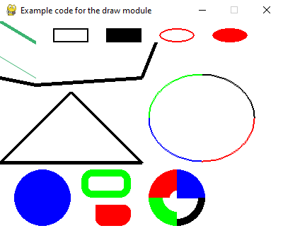

.. include:: common.txt

:mod:`pygame.draw`
==================

.. module:: pygame.draw
   :synopsis: pygame module for drawing shapes

| :sl:`pygame module for drawing shapes`

Draw several simple shapes to a Surface. These functions will work for
rendering to any format of Surface. Rendering to hardware Surfaces will be
slower than regular software Surfaces.

Most of the functions take a width argument to represent the size of stroke
around the edge of the shape. If a width of 0 is passed the function will
actually solid fill the entire shape.

All the drawing functions respect the clip area for the Surface, and will be
constrained to that area. The functions return a rectangle representing the
bounding area of changed pixels.

Most of the arguments accept a color argument that is an ``RGB`` triplet. These
can also accept an ``RGBA`` quadruplet. The alpha value will be written
directly into the Surface if it contains pixel alphas, but the draw function
will not draw transparently. The color argument can also be an integer pixel
value that is already mapped to the Surface's pixel format.

These functions must temporarily lock the Surface they are operating on. Many
sequential drawing calls can be sped up by locking and unlocking the Surface
object around the draw calls.

.. function:: rect

   | :sl:`draw a rectangle shape`
   | :sg:`rect(Surface, color, Rect, width=0) -> Rect`

   Draws a rectangular shape on the Surface. The given Rect is the area of the
   rectangle. The width argument is the thickness to draw the outer edge. If
   width is zero then the rectangle will be filled.

   Keep in mind the ``Surface.fill()`` method works just as well for drawing
   filled rectangles. In fact the ``Surface.fill()`` can be hardware
   accelerated on some platforms with both software and hardware display modes.

   .. ## pygame.draw.rect ##

.. function:: polygon

   | :sl:`draw a shape with any number of sides`
   | :sg:`polygon(Surface, color, pointlist, width=0) -> Rect`

   Draws a polygonal shape on the Surface. The pointlist argument is the
   vertices of the polygon. The width argument is the thickness to draw the
   outer edge. If width is zero then the polygon will be filled.

   For aapolygon, use aalines with the 'closed' parameter.

   .. ## pygame.draw.polygon ##

.. function:: circle

   | :sl:`draw a circle around a point`
   | :sg:`circle(Surface, color, pos, radius, width=0) -> Rect`

   Draws a circular shape on the Surface. The pos argument is the center of the
   circle, and radius is the size. The width argument is the thickness to draw
   the outer edge. If width is zero then the circle will be filled.

   .. ## pygame.draw.circle ##

.. function:: ellipse

   | :sl:`draw a round shape inside a rectangle`
   | :sg:`ellipse(Surface, color, Rect, width=0) -> Rect`

   Draws an elliptical shape on the Surface. The given rectangle is the area
   that the circle will fill. The width argument is the thickness to draw the
   outer edge. If width is zero then the ellipse will be filled.

   .. ## pygame.draw.ellipse ##

.. function:: arc

   | :sl:`draw a partial section of an ellipse`
   | :sg:`arc(Surface, color, Rect, start_angle, stop_angle, width=1) -> Rect`

   Draws an elliptical arc on the Surface. The rect argument is the area that
   the ellipse will fill. The two angle arguments are the initial and final
   angle in radians, with the zero on the right. The width argument is the
   thickness to draw the outer edge.

   .. ## pygame.draw.arc ##

.. function:: line

   | :sl:`draw a straight line segment`
   | :sg:`line(Surface, color, start_pos, end_pos, width=1) -> Rect`

   Draw a straight line segment on a Surface. There are no endcaps, the ends
   are squared off for thick lines.

   .. ## pygame.draw.line ##

.. function:: lines

   | :sl:`draw multiple contiguous line segments`
   | :sg:`lines(Surface, color, closed, pointlist, width=1) -> Rect`

   Draw a sequence of lines on a Surface. The pointlist argument is a series of
   points that are connected by a line. If the closed argument is true an
   additional line segment is drawn between the first and last points.

   This does not draw any endcaps or miter joints. Lines with sharp corners and
   wide line widths can have improper looking corners.

   .. ## pygame.draw.lines ##

.. function:: aaline

   | :sl:`draw fine antialiased lines`
   | :sg:`aaline(Surface, color, startpos, endpos, blend=1) -> Rect`

   Draws an anti-aliased line on a surface. This will respect the clipping
   rectangle. A bounding box of the affected area is returned as a
   rectangle. If blend is true, the shades will be be blended with existing
   pixel shades instead of overwriting them. This function accepts floating
   point values for the end points.

   .. ## pygame.draw.aaline ##

.. function:: aalines

   | :sl:`draw a connected sequence of antialiased lines`
   | :sg:`aalines(Surface, color, closed, pointlist, blend=1) -> Rect`

   Draws a sequence on a surface. You must pass at least two points in the
   sequence of points. The closed argument is a simple Boolean and if true, a
   line will be draw between the first and last points. The Boolean blend
   argument set to true will blend the shades with existing shades instead of
   overwriting them. This function accepts floating point values for the end
   points.

   .. ## pygame.draw.aalines ##

.. ## pygame.draw ##

   Example code for draw module.
   
.. literalinclude:: code_examples/draw_module_example.py
   
