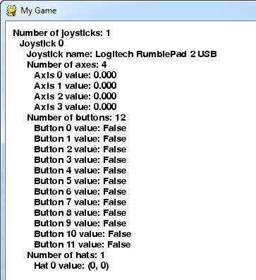

.. include:: common.txt

:mod:`pygame.joystick`
======================

.. module:: pygame.joystick
   :synopsis: Pygame module for interacting with joysticks, gamepads, and trackballs.

| :sl:`Pygame module for interacting with joysticks, gamepads, and trackballs.`

The joystick module manages the joystick devices on a computer.
Joystick devices include trackballs and video-game-style
gamepads, and the module allows the use of multiple buttons and "hats".
Computers may manage multiple joysticks at a time.

Each instance of the Joystick class represents one gaming device plugged
into the computer. If a gaming pad has multiple joysticks on it, than the
joystick object can actually represent multiple joysticks on that single
game device.

For a quick way to initialise the joystick module and get a list of Joystick instances
use the following code::

    pygame.joystick.init()
    joysticks = [pygame.joystick.Joystick(x) for x in range(pygame.joystick.get_count())]

The following event types will be generated by the joysticks ::

    JOYAXISMOTION JOYBALLMOTION JOYBUTTONDOWN JOYBUTTONUP JOYHATMOTION

And in pygame 2, which supports hotplugging::

   JOYDEVICEADDED JOYDEVICEREMOVED

Note that in pygame 2, joysticks events use a unique "instance ID". The device index
passed in the constructor to a Joystick object is not unique after devices have
been added and removed. You must call :meth:`Joystick.get_instance_id()` to find
the instance ID that was assigned to a Joystick on opening.

The event queue needs to be pumped frequently for some of the methods to work.
So call one of pygame.event.get, pygame.event.wait, or pygame.event.pump regularly.

.. function:: init

   | :sl:`Initialize the joystick module.`
   | :sg:`init() -> None`

   This function is called automatically by ``pygame.init()``.

   It initializes the joystick module. The module must be initialized before any
   other functions will work.

   It is safe to call this function more than once.

   .. ## pygame.joystick.init ##

.. function:: quit

   | :sl:`Uninitialize the joystick module.`
   | :sg:`quit() -> None`

   Uninitialize the joystick module. After you call this any existing joystick
   objects will no longer work.

   It is safe to call this function more than once.

   .. ## pygame.joystick.quit ##

.. function:: get_init

   | :sl:`Returns True if the joystick module is initialized.`
   | :sg:`get_init() -> bool`

   Test if the ``pygame.joystick.init()`` function has been called.

   .. ## pygame.joystick.get_init ##

.. function:: get_count

   | :sl:`Returns the number of joysticks.`
   | :sg:`get_count() -> count`

   Return the number of joystick devices on the system. The count will be ``0`` 
   if there are no joysticks on the system.

   When you create Joystick objects using ``Joystick(id)``, you pass an integer
   that must be lower than this count.

   .. ## pygame.joystick.get_count ##

.. class:: Joystick

   | :sl:`Create a new Joystick object.`
   | :sg:`Joystick(id) -> Joystick`

   Create a new joystick to access a physical device. The id argument must be a
   value from ``0`` to ``pygame.joystick.get_count() - 1``.

   Joysticks are initialised on creation and are shut down when deallocated.
   Once the device is initialized the pygame event queue will start receiving
   events about its input.

   .. versionchanged:: 2.0.0 Joystick objects are now opened immediately on creation.

   .. method:: init

      | :sl:`initialize the Joystick`
      | :sg:`init() -> None`

      Initialize the joystick, if it has been closed. It is safe to call this
      even if the joystick is already initialized.

      .. deprecated:: 2.0.0

         In future it will not be possible to reinitialise a closed Joystick
         object. Will be removed in Pygame 2.1.

      .. ## Joystick.init ##

   .. method:: quit

      | :sl:`uninitialize the Joystick`
      | :sg:`quit() -> None`

      Close a Joystick object. After this the pygame event queue will no longer
      receive events from the device.

      It is safe to call this more than once.

      .. ## Joystick.quit ##

   .. method:: get_init

      | :sl:`check if the Joystick is initialized`
      | :sg:`get_init() -> bool`

      Return True if the Joystick object is currently initialised.

      .. ## Joystick.get_init ##

   .. method:: get_id

      | :sl:`get the device index (deprecated)`
      | :sg:`get_id() -> int`

      Returns the original device index for this device. This is the same
      value that was passed to the ``Joystick()`` constructor. This method can
      safely be called while the Joystick is not initialized.

      .. deprecated:: 2.0.0

         The original device index is not useful in pygame 2. Use
         :meth:`.get_instance_id` instead. Will be removed in Pygame 2.1.

   .. method:: get_instance_id() -> int

      | :sl:`get the joystick instance id`
      | :sg:`get_instance_id() -> int`

      Get the joystick instance ID. This matches the ``instance_id`` field
      that is given in joystick events.

      .. versionadded:: 2.0.0dev11

   .. method:: get_guid() -> str

      | :sl:`get the joystick GUID`
      | :sg:`get_guid() -> str`

      Get the GUID string. This identifies the exact hardware of the joystick
      device.

      .. versionadded:: 2.0.0dev11

   .. method:: get_power_level() -> str

      | :sl:`get the approximate power status of the device`
      | :sg:`get_power_level() -> str`

      Get a string giving the power status of the device.

      One of: ``empty``, ``low``, ``medium``, ``full``, ``wired``, ``max``, or
      ``unknown``.

      .. versionadded:: 2.0.0dev11

      .. ## Joystick.get_id ##

   .. method:: get_name

      | :sl:`get the Joystick system name`
      | :sg:`get_name() -> string`

      Returns the system name for this joystick device. It is unknown what name
      the system will give to the Joystick, but it should be a unique name that
      identifies the device. This method can safely be called while the
      Joystick is not initialized.

      .. ## Joystick.get_name ##

   .. method:: get_numaxes

      | :sl:`get the number of axes on a Joystick`
      | :sg:`get_numaxes() -> int`

      Returns the number of input axes are on a Joystick. There will usually be
      two for the position. Controls like rudders and throttles are treated as
      additional axes.

      The ``pygame.JOYAXISMOTION`` events will be in the range from ``-1.0`` 
      to ``1.0``. A value of ``0.0`` means the axis is centered. Gamepad devices 
      will usually be ``-1``, ``0``, or ``1`` with no values in between. Older 
      analog joystick axes will not always use the full ``-1`` to ``1`` range, 
      and the centered value will be some area around ``0``. 
      
      Analog joysticks usually have a bit of noise in their axis, which will 
      generate a lot of rapid small motion events.

      .. ## Joystick.get_numaxes ##

   .. method:: get_axis

      | :sl:`get the current position of an axis`
      | :sg:`get_axis(axis_number) -> float`

      Returns the current position of a joystick axis. The value will range
      from ``-1`` to ``1`` with a value of ``0`` being centered. You may want 
      to take into account some tolerance to handle jitter, and joystick drift 
      may keep the joystick from centering at ``0`` or using the full range of 
      position values.

      The axis number must be an integer from ``0`` to ``get_numaxes() - 1``.

      When using gamepads both the control sticks and the analog triggers are
      usually reported as axes.

      .. ## Joystick.get_axis ##

   .. method:: get_numballs

      | :sl:`get the number of trackballs on a Joystick`
      | :sg:`get_numballs() -> int`

      Returns the number of trackball devices on a Joystick. These devices work
      similar to a mouse but they have no absolute position; they only have
      relative amounts of movement.

      The ``pygame.JOYBALLMOTION`` event will be sent when the trackball is
      rolled. It will report the amount of movement on the trackball.

      .. ## Joystick.get_numballs ##

   .. method:: get_ball

      | :sl:`get the relative position of a trackball`
      | :sg:`get_ball(ball_number) -> x, y`

      Returns the relative movement of a joystick button. The value is a ``x, y``
      pair holding the relative movement since the last call to get_ball.

      The ball number must be an integer from ``0`` to ``get_numballs() - 1``.

      .. ## Joystick.get_ball ##

   .. method:: get_numbuttons

      | :sl:`get the number of buttons on a Joystick`
      | :sg:`get_numbuttons() -> int`

      Returns the number of pushable buttons on the joystick. These buttons
      have a boolean (on or off) state.

      Buttons generate a ``pygame.JOYBUTTONDOWN`` and ``pygame.JOYBUTTONUP``
      event when they are pressed and released.

      .. ## Joystick.get_numbuttons ##

   .. method:: get_button

      | :sl:`get the current button state`
      | :sg:`get_button(button) -> bool`

      Returns the current state of a joystick button.

      .. ## Joystick.get_button ##

   .. method:: get_numhats

      | :sl:`get the number of hat controls on a Joystick`
      | :sg:`get_numhats() -> int`

      Returns the number of joystick hats on a Joystick. Hat devices are like
      miniature digital joysticks on a joystick. Each hat has two axes of
      input.

      The ``pygame.JOYHATMOTION`` event is generated when the hat changes
      position. The ``position`` attribute for the event contains a pair of 
      values that are either ``-1``, ``0``, or ``1``. A position of ``(0, 0)`` 
      means the hat is centered.

      .. ## Joystick.get_numhats ##

   .. method:: get_hat

      | :sl:`get the position of a joystick hat`
      | :sg:`get_hat(hat_number) -> x, y`

      Returns the current position of a position hat. The position is given as
      two values representing the ``x`` and ``y`` position for the hat. ``(0, 0)``
      means centered. A value of ``-1`` means left/down and a value of ``1`` means
      right/up: so ``(-1, 0)`` means left; ``(1, 0)`` means right; ``(0, 1)`` means 
      up; ``(1, 1)`` means upper-right; etc.

      This value is digital, ``i.e.``, each coordinate can be ``-1``, ``0`` or ``1`` 
      but never in-between.

      The hat number must be between ``0`` and ``get_numhats() - 1``.

      .. ## Joystick.get_hat ##

   .. ## pygame.joystick.Joystick ##

.. ## pygame.joystick ##

   Example code for joystick module.

.. literalinclude:: code_examples/joystick_calls.py

.. _controller-mappings:

**Common Controller Axis Mappings**

Controller mappings are drawn from the underlying SDL library which pygame uses and they differ
between pygame 1 and pygame 2. Below are a couple of mappings for two popular game pads.

**Pygame 2**

Axis and hat mappings are listed from -1 to +1.

**X-Box 360 Controller (name: "Xbox 360 Controller")**

In pygame 2 the X360 controller mapping has 6 Axes, 11 buttons and 1 hat.

* **Left Stick**::

    Left -> Right   - Axis 0
    Up   -> Down    - Axis 1

* **Right Stick**::

    Left -> Right   - Axis 3
    Up   -> Down    - Axis 4

* **Left Trigger**::

    Out -> In       - Axis 2

* **Right Trigger**::

    Out -> In       - Axis 5

* **Buttons**::

    A Button        - Button 0
    B Button        - Button 1
    X Button        - Button 2
    Y Button        - Button 3
    Left Bumper     - Button 4
    Right Bumper    - Button 5
    Back Button     - Button 6
    Start Button    - Button 7
    L. Stick In     - Button 8
    R. Stick In     - Button 9
    Guide Button    - Button 10

* **Hat/D-pad**::

    Down -> Up      - Y Axis
    Left -> Right   - X Axis

**Playstation 4 Controller (name: "PS4 Controller")**

In pygame 2 the PS4 controller mapping has 6 Axes and 16 buttons.

* **Left Stick**::

    Left -> Right   - Axis 0
    Up   -> Down    - Axis 1

* **Right Stick**::

    Left -> Right   - Axis 2
    Up   -> Down    - Axis 3

* **Left Trigger**::

    Out -> In       - Axis 4

* **Right Trigger**::

    Out -> In       - Axis 5

* **Buttons**::

    Cross Button    - Button 0
    Circle Button   - Button 1
    Square Button   - Button 2
    Triangle Button - Button 3
    Share Button    - Button 4
    PS Button       - Button 5
    Options Button  - Button 6
    L. Stick In     - Button 7
    R. Stick In     - Button 8
    Left Bumper     - Button 9
    Right Bumper    - Button 10
    D-pad Up        - Button 11
    D-pad Down      - Button 12
    D-pad Left      - Button 13
    D-pad Right     - Button 14
    Touch Pad Click - Button 15

**Pygame 1**

Axis and hat mappings are listed from -1 to +1.

**X-Box 360 Controller (name: "Controller (XBOX 360 For Windows)")**

In pygame 1 the X360 controller mapping has 5 Axes, 10 buttons and 1 hat.

* **Left Stick**::

    Left -> Right   - Axis 0
    Up   -> Down    - Axis 1

* **Right Stick**::

    Left -> Right   - Axis 4
    Up   -> Down    - Axis 3

* **Left Trigger & Right Trigger**::

    RT -> LT        - Axis 2

* **Buttons**::

    A Button        - Button 0
    B Button        - Button 1
    X Button        - Button 2
    Y Button        - Button 3
    Left Bumper     - Button 4
    Right Bumper    - Button 5
    Back Button     - Button 6
    Start Button    - Button 7
    L. Stick In     - Button 8
    R. Stick In     - Button 9

* **Hat/D-pad**::

    Down -> Up      - Y Axis
    Left -> Right   - X Axis

**Playstation 4 Controller (name: "Wireless Controller")**

In pygame 1 the PS4 controller mapping has 6 Axes and 14 buttons and 1 hat.

* **Left Stick**::

    Left -> Right   - Axis 0
    Up   -> Down    - Axis 1

* **Right Stick**::

    Left -> Right   - Axis 2
    Up   -> Down    - Axis 3

* **Left Trigger**::

    Out -> In       - Axis 5

* **Right Trigger**::

    Out -> In       - Axis 4

* **Buttons**::

    Cross Button    - Button 0
    Circle Button   - Button 1
    Square Button   - Button 2
    Triangle Button - Button 3
    Left Bumper     - Button 4
    Right Bumper    - Button 5
    L. Trigger(Full)- Button 6
    R. Trigger(Full)- Button 7
    Share Button    - Button 8
    Options Button  - Button 9
    L. Stick In     - Button 10
    R. Stick In     - Button 11
    PS Button       - Button 12
    Touch Pad Click - Button 13

* **Hat/D-pad**::

    Down -> Up      - Y Axis
    Left -> Right   - X Axis
