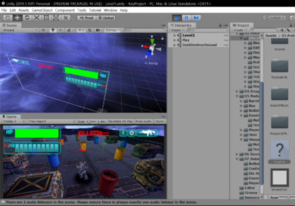

====================================
Author: Youngwook Kim (Korean)
====================================

====================================
Contact: rumia0601@gmail.com
====================================

====================================
Prolog? Why Pygame?
====================================
As we know, every kind of game has 3 sections (Because game is a subgroup of program): **input**, **process** and **output**. If you want to make a game in C **console environment** (Write C source code then execute that on the console) simply, all you have to do is just using lots of scanf(or unnormalized getch function) functions and procedural complex algorithm followed by printf(with blinking clear function) functions with ASCII arts! However, when you get bored of making outdated, graphic-less CUI, discontinuous game, now it’s time to learn GUI based game making tool. You can directly enter into Unity **game engine** or Unreal game engine. However, there are too much barrier to overcome. Quaternion for 3D collision, Mechanim/Legacy animation compatibility, Larger memory/Faster CPU for simulate in high-graphic mod, and etc! So, there is a dilemma between console environment and game engine. Can this dilemma to be solved?

.. image:: introduction-PuyoPuyo.png
   :class: inlined-right

.. code-block:: python

   import sys, pygame
   pygame.init()

   size = width, height = 220, 140
   speed = [2, 2]
   black = 0, 0, 0

   screen = pygame.display.set_mode(size)

   ball = pygame.image.load("introduction-PuyoPuyo.png")
   ballrect = ball.get_rect()

   while True:
       for event in pygame.event.get():
           if event.type == pygame.QUIT: sys.exit()

       ballrect = ballrect.move(speed)
       if ballrect.left < 0 or ballrect.right > width:
           speed[0] = -speed[0]
       if ballrect.top < 0 or ballrect.bottom > height:
           speed[1] = -speed[1]

       screen.fill(black)
       screen.blit(ball, ballrect)
       pygame.display.flip()

(Example of C console game - PuyoPuyo)

.. code-block:: python

   import sys, pygame
   pygame.init()

   size = width, height = 220, 140
   speed = [2, 2]
   black = 0, 0, 0

   screen = pygame.display.set_mode(size)

   ball = pygame.image.load("introduction-TPS.png")
   ballrect = ball.get_rect()

   while True:
       for event in pygame.event.get():
           if event.type == pygame.QUIT: sys.exit()

       ballrect = ballrect.move(speed)
       if ballrect.left < 0 or ballrect.right > width:
           speed[0] = -speed[0]
       if ballrect.top < 0 or ballrect.bottom > height:
           speed[1] = -speed[1]

       screen.fill(black)
       screen.blit(ball, ballrect)
       pygame.display.flip()

(Example of Unity Engine game - TPS)

Yes. Pygame can solve that. Pygame is an external library of **Python** which enables you to make a **game**. Pygame has advantages of console environment. For example, single pygame project nearly equals single source code, so we have to focus on writing source code only. (with some sound file or some image file in the same directory). Because Pygame is not a tool but a library, single command “import pygame” makes current source code to use pygame’s everything. That is, Pygame is simple to access. Pygame has advantages of game engine, too. For example, Pygame provide input functions (which check every possible state of keyboard, mouse and even files) and output functions (drawing geometry, fill certain colors or set display) to user. That is, user can run the program on the GUI environment if it based on Pygame. Because Pygame is based on Python, functions in Pygame project can be executed selectively, even almost simultaneously. That is, Pygame is event-driven.

.. image:: introduction-Battleship.png
   :class: inlined-right

.. code-block:: python

   import sys, pygame
   pygame.init()

   size = width, height = 220, 140
   speed = [2, 2]
   black = 0, 0, 0

   screen = pygame.display.set_mode(size)

   ball = pygame.image.load("introduction-Battleship.png")
   ballrect = ball.get_rect()

   while True:
       for event in pygame.event.get():
           if event.type == pygame.QUIT: sys.exit()

       ballrect = ballrect.move(speed)
       if ballrect.left < 0 or ballrect.right > width:
           speed[0] = -speed[0]
       if ballrect.top < 0 or ballrect.bottom > height:
           speed[1] = -speed[1]

       screen.fill(black)
       screen.blit(ball, ballrect)
       pygame.display.flip()

(Example of Pygame - Battleship)

So, Pygame has both good point of console environment (example of low-level game maker) and game engine (example of high-level game maker). Pygame is good **intersection** between console environment to game engine. That’s enough to use Pygame. No need to master it (if your dream is one-man game developer in advanced game engine, start to learn about that game engine right now!), but at least, try Pygame. (if you are interested in any kind of unique program including game maker or if you want to code any game on advanced environment aside from console environment)
