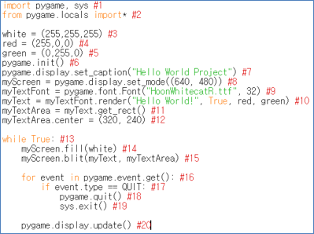

====================================
Author: Youngwook Kim (Korean)
====================================

====================================
Contact: rumia0601@gmail.com
====================================

====================================
Basic TEMPLATE and OUTPUT
====================================

====================================
–Into Event-driven and GUI
====================================
As I said, Pygame is based on GUI environment. Furthermore, Pygame is good for making 2D game because of its input/output format. So, you have to say good-bye for print or input standard function of Python (Because they work only on CUI environment). Then, what functions in Pygame replace these functions? First, we have to go back to friendly “Hello World!” project, which is learning about basic template and output. **(Requiring any font file(.ttf) in the same project directory)**

.. code-block:: python
   :linenos:

   import sys, pygame
   pygame.init()

   size = width, height = 220, 140
   speed = [2, 2]
   black = 0, 0, 0

   screen = pygame.display.set_mode(size)

   ball = pygame.image.load("Basic-ouput-sourcecode.png")
   ballrect = ball.get_rect()

   while True:
       for event in pygame.event.get():
           if event.type == pygame.QUIT: sys.exit()

       ballrect = ballrect.move(speed)
       if ballrect.left < 0 or ballrect.right > width:
           speed[0] = -speed[0]
       if ballrect.top < 0 or ballrect.bottom > height:
           speed[1] = -speed[1]

       screen.fill(black)
       screen.blit(ball, ballrect)
       pygame.display.flip()

.. image:: Bagic-ouput-result-screen.png
   :class: inlined-right

.. code-block:: python
   :linenos:

   import sys, pygame
   pygame.init()

   size = width, height = 220, 140
   speed = [2, 2]
   black = 0, 0, 0

   screen = pygame.display.set_mode(size)

   ball = pygame.image.load("Bagic-ouput-result-screen.png")
   ballrect = ball.get_rect()

   while True:
       for event in pygame.event.get():
           if event.type == pygame.QUIT: sys.exit()

       ballrect = ballrect.move(speed)
       if ballrect.left < 0 or ballrect.right > width:
           speed[0] = -speed[0]
       if ballrect.top < 0 or ballrect.bottom > height:
           speed[1] = -speed[1]

       screen.fill(black)
       screen.blit(ball, ballrect)
       pygame.display.flip()

(Source Code for Hello World Project and its result screen)

Wow, it’s complicated in compare to python’s print(“Hello World”) (Just a single line command). It’s because text in GUI environment has 5 components: text contents, font, size, color and location. If you want to print any text into screen, you have to set other 4 components, not only string (unless when it is in GUI environment). Only ``pygame.display.set_caption(“Hello World Project”)`` function in #7 do the same function as python’s print(“Hello World Project”). The only difference is that output string is always on window caption (title of current program)

First, look at the template of source code before understanding how to output something, source code can be dived into 4 sections: Header(#1-#2), Initial statement(#3-#12), Always statement(#13-#20) and Event statement(#16-#19).

In **Header**, importing modules will be executed. ``import pygame, sys`` is always needed. Needless to say, because this is pygame project and game has to be terminated when player want to exit(``sys.exit()`` at #19). ``from pygame.locals import*`` is also necessary to use useful constants just like ``QUIT`` at #17.
In **Initial statement** (commands before infinite loop), some global values will be initialized and some functions will be called for one time. Global values just like colors has to be initialized here in order to increase readability. Remember, this is GUI which is colorful. Color has three components: red, green and blue. So, color value has to be initialized just like ``red = (255, 0, 0)``. Function named ``pygame.init()`` must be called preceding to other pygame functions. Then other pygame functions can be executed. (Other pygame functions will be explained later.)

In **Always statement** (commands within infinite loop), some global values will be updated routinely and some functions will be called routinely unless they are enclosed into conditional statement. Function named ``pygame.display.update()`` should be called after every processes are done. Because this function is printing the results of processes onto screen(=monitor). If this function is not executed in the last part of Always statement, there will be a probability that current screen and internal data does not match. (Other pygame functions will be explained later.)

In **Event statement** (commands within loop which check every possible events), there will be suitable conditional statements when certain event is triggered. ``pygame.event.get()`` function returns a list of events occurred by processes in Always statement. And this list is automatically arranged by time (oldest to newest). So, using for-in statement, every triggered event caused by Always statement can be resolved procedurally. (Remind that this is the trait of event-driven.) For example, commands in #17-#19 will deal with QUIT event. In this case, pygame will be terminated then system will be terminated because system must be terminated after pygame is terminated! (Other events will be explained later.)

Regarding this template is fixed, then we can add special functions in correct place to print “Hello World!”. First, we need to set **font** and **size**. ``pygame.font.Font(“HoonWhiteCatR,ttf”, 32)`` function at #9 will set not only font by ttf file but also size (32). Return value of this function need to be stored into object(= myTextFont). Then member function of myTextFont named ``render(“Hello World!”, True, red, green)`` at #10 will return a value(= myText). render function can set **text contents** and **color**(red is color of text, green is color of area outside of text). Then member function of myText named ``get_rect()`` at #11 will return a value(= myTextArea). myTextArea means the area allocated for printing text. When get_rect() is called, a rectangle area is returned corresponding to text’s length and font size. Now, all we have to do is locating this area somewhere. If we change member value of myTextArea named ``center`` at #12 into center of screen, then the text’s center **location** will be center of the screen.

But how to determine where is the center of screen? First, we have to decide the range of screen, by using ``pygame.display.set_mode((640,480))`` in #8, canvas(where all values which has size, color, position will be drawn when display.update is called) will be generated and its size becomes 640 x 480. Then, its center is exactly (320,240). If the total size is given, we can decide any position even accounting some margin with little calculation (Remind that in 2D GUI, everything has x and y which has to be printed) (Just like turtle graphic, if it goes **right, x increases**, if it goes **down**, **y increase**. Don’t confused!). And we know that all functions I mentioned will be putted into Initial statement, because this information are fixed while the program go on.
Although everything is fixed, we have to design that fill and blit functions to be putted into Always statement, because of these functions’ trait. ``fill(white)`` function in #14 means filling canvas by single color(white). ``blit(myText, myTextArea)`` function in #15 means drawing specific object(= myText) on specific location(= myTextArea) of canvas. Notice that drawing(blit) has to be done after filling(fill). When everything is drawn on canvas, result of canvas will be display onto window when display.update is executed.

That was the explanation of the entire source code, which has 20 lines. It seems it takes too much time to understand source code with only 20 lines. However, adding or changing from this source code is not that hard because we understand the template of this source code and step of printing. What about adding process logic in this source code? That will be next project.

<Reference Code> ::

    import pygame, sys #1
    from pygame.locals import* #2

    white = (255,255,255) #3
    red = (255,0,0) #4
    green = (0,255,0) #5
    pygame.init() #6
    pygame.display.set_caption("Hello World Project") #7
    myScreen = pygame.display.set_mode((640, 480)) #8
    myTextFont = pygame.font.Font("HoonWhitecatR.ttf", 32) #9
    myText = myTextFont.render("Hello World!", True, red, green) #10 
    myTextArea = myText.get_rect() #11
    myTextArea.center = (320, 240) #12

    while True: #13
        myScreen.fill(white) #14
        myScreen.blit(myText, myTextArea) #15

        for event in pygame.event.get(): #16
            if event.type == QUIT: #17
                pygame.quit() #18
                sys.exit() #19

        pygame.display.update() #20

