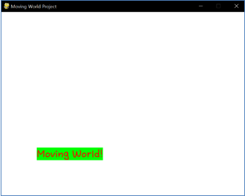

====================================
Author: Youngwook Kim (Korean)
====================================

====================================
Contact: rumia0601@gmail.com
====================================

====================================
Basic PROCESS
====================================

====================================
-Setting for Animation
====================================
Previous project looks like a single image instead of game. Because there is no input neither process to control output. Of course, clicking exit button on window is not counted because it is just shutting down the entire program. First, we will let text “Hello World!” to move automatically (and now project will be looks like an animation rather than single image), which means adding first processing logic on this project. How to move text? We know that location of text is initialized in Initial statement. So, location of text should be updated in Always statement, with adding some variable to process something.

.. image:: Bagic-PROCESS-sourcecode.png
   :class: inlined-right

.. code-block:: python
   :linenos:

   import sys, pygame
   pygame.init()

   size = width, height = 220, 140
   speed = [2, 2]
   black = 0, 0, 0

   screen = pygame.display.set_mode(size)

   ball = pygame.image.load("Bagic-PROCESS-sourcecode.png")
   ballrect = ball.get_rect()

   while True:
       for event in pygame.event.get():
           if event.type == pygame.QUIT: sys.exit()

       ballrect = ballrect.move(speed)
       if ballrect.left < 0 or ballrect.right > width:
           speed[0] = -speed[0]
       if ballrect.top < 0 or ballrect.bottom > height:
           speed[1] = -speed[1]

       screen.fill(black)
       screen.blit(ball, ballrect)
       pygame.display.flip()

.. code-block:: python
   :linenos:

   import sys, pygame
   pygame.init()

   size = width, height = 220, 140
   speed = [2, 2]
   black = 0, 0, 0

   screen = pygame.display.set_mode(size)

   ball = pygame.image.load("Bagic-PROCESS-resultscreen.png")
   ballrect = ball.get_rect()

   while True:
       for event in pygame.event.get():
           if event.type == pygame.QUIT: sys.exit()

       ballrect = ballrect.move(speed)
       if ballrect.left < 0 or ballrect.right > width:
           speed[0] = -speed[0]
       if ballrect.top < 0 or ballrect.bottom > height:
           speed[1] = -speed[1]

       screen.fill(black)
       screen.blit(ball, ballrect)
       pygame.display.flip()

(Source Code for Moving World Project and its result screen)

(Not the entire source code of Moving World Project, but part)

(Moving World! moves automatically just like Arkanoid ball or DVD screensaver.)

New line #1 - #5 were appended at the end of Initial statement. Also, multiple if-else phases (#6 - #9) were inserted at the beginning of Always statement, with line #11 at the end of always statements. We can understand what commands of #2 - #10 do. They just change variables for position of “Moving World” when Always statement being started. But there is a problem. How fast is “Moving World?” It is sure that displacement of “Moving World” is sqrt(2) (simple Pythagorean equation). But how often displacement of “Moving World” is changed? It can’t be determined without calculating time complexity of Always statement! (Because it depends on how often Always statement being started) And time complex will be differ to computer to computer, so can’t be fixed.

We need to add the conception of **fixed speed** into this project. How? Look at #1 and #11. There is ``pygame.time.Clock()`` on Initial statement and ``tick(60)`` on Always statement. 60 means FPS (frame rate per second). We know that FPS means how often display is changed in 1 second. What function means change (= update) display in pygame? That’s right. Pygame.display.update() function. So, FPS means how often Always statement being executed in 1 second. Because there is 1 Pygame.display.update() function in 1 always statements. (So, FPS means **selective delay** according to current program’s process speed, **not selective acceleration**, so FPS cannot work if FPS is too high.) If we let fps(= **time**) to be fixed in this project, we can change **velocity** of certain game object by finding appropriate value for **displacement**. pygame.time.Clock() is needed to fix the speed of project before game started. Notice that tick function has to be called when Pygame.display.update() is called. Because tick counts the number of update function. It is one of the exception of function that can be executed after Pygame.display.update().

Okay, we learn that “Fixing time” is needed when screen is updated. Every screen of dynamic game is frequently changed unless it is static game. So, we have to know that. However, this project isn’t look like a game because its result can be anticipated easily (there is no input to change result) Now, input logic will be inserted.

<Reference Code> ::

    import pygame, sys
    from pygame.locals import*

    white = (255,255,255)
    red = (255,0,0)
    green = (0,255,0)
    pygame.init()
    pygame.display.set_caption("Moving World Project") 
    myScreen = pygame.display.set_mode((640, 480))
    myTextFont = pygame.font.Font("HoonWhitecatR.ttf", 32)
    myText = myTextFont.render("Moving World!", True, red, green) 
    myTextArea = myText.get_rect()
    myTextArea.center = (320, 240)
    fpsClock = pygame.time.Clock() #1
    x = 0 #2
    y = 0 #3
    moveRight = 1 #4
    moveUp= 1 #5

    while True:
        if (moveRight == 1): #6
            x = x + 1
            if (x >= 320 - 75):
                moveRight = 0
        elif (moveRight == 0): #7
            x = x - 1
            if (x <= -320 + 75):
                moveRight = 1

        if (moveUp == 1): #8
            y = y + 1
            if (y >= 240 - 15):
                moveUp = 0
        elif (moveUp == 0): #9
            y = y - 1
            if (y <= -240 + 15):
                moveUp = 1

    myTextArea.center = (320 + x, 240 + y) #10
    
    myScreen.fill(white)
    myScreen.blit(myText, myTextArea)

    for event in pygame.event.get():
        if event.type == QUIT:
            pygame.quit()
            sys.exit()

    pygame.display.update()
    fpsClock.tick(60) #11

