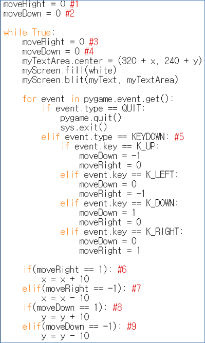
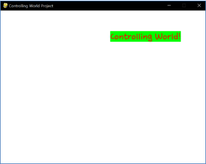

====================================
Author: Youngwook Kim (Korean)
====================================

====================================
Contact: rumia0601@gmail.com
====================================

====================================
Basic INPUT
====================================

====================================
-New Input is new Event
====================================
Usually, we learn how to output something first (Think about Hello World!), learning how to input something is always second. Why? Because input is not the requirement for some program in contrast to output is the requirement for every program. (That’s definition of program. more than or same as 0 input, more than or same as 1 output.) However, every game needs input. That’s why we said “I like playing games”. Playing means moving your part of body (maybe your finger). Anyway, let’s add input logic to make this project into real game.

.. code-block:: python

   import sys, pygame
   pygame.init()

   size = width, height = 220, 140
   speed = [2, 2]
   black = 0, 0, 0

   screen = pygame.display.set_mode(size)

   ball = pygame.image.load("Bagic-INPUT-sourcecode.png")
   ballrect = ball.get_rect()

   while True:
       for event in pygame.event.get():
           if event.type == pygame.QUIT: sys.exit()

       ballrect = ballrect.move(speed)
       if ballrect.left < 0 or ballrect.right > width:
           speed[0] = -speed[0]
       if ballrect.top < 0 or ballrect.bottom > height:
           speed[1] = -speed[1]

       screen.fill(black)
       screen.blit(ball, ballrect)
       pygame.display.flip()

.. code-block:: python

   import sys, pygame
   pygame.init()

   size = width, height = 220, 140
   speed = [2, 2]
   black = 0, 0, 0

   screen = pygame.display.set_mode(size)

   ball = pygame.image.load("Bagic-INPUT-resultscreen.png")
   ballrect = ball.get_rect()

   while True:
       for event in pygame.event.get():
           if event.type == pygame.QUIT: sys.exit()

       ballrect = ballrect.move(speed)
       if ballrect.left < 0 or ballrect.right > width:
           speed[0] = -speed[0]
       if ballrect.top < 0 or ballrect.bottom > height:
           speed[1] = -speed[1]

       screen.fill(black)
       screen.blit(ball, ballrect)
       pygame.display.flip()

(Source Code for Controlling World Project and its result screen)

(Not the entire source code of Controlling World Project, but part)

(Controlling World! moves when player press one of four direction arrow of keyboard)

There are 2 big difference in comparison to before project. First big difference is line #5, which adds checking ``KEYDOWN`` **event** is triggered or not. Other lines are just changing previous algorithm to act differently. We know that same command can make big difference in entire program when it is executed before Event statement of after Event statement. Pay attention that process about changing location appear after Event statement. (**Update after set**. That is second big difference). Variable ``event.key`` means latest pressed key on keyboard. Look at the specific key name. K_UP, K_LEFT, K_DOWN, K_RIGHT. Very intuitive **K_ series**. (Given by pygame.locals which we added at the Header) Furthermore, there are other key named K_8, K_a, K_L, K_LCTRL, K_DELETE, or K_F4. We can understand meaning of these keys without extra explanation. Full key list can be found in  
`https://www.pygame.org/docs/ref/key.html#pygame.key.name.`

Notice that KEYDOWN means “this key was not pressed before, but **now is pressed**” and meaning of **“hold” is not included** here. In the case of hold, new event-handling about checking ``KEYUP`` (it means “this key was pressed before, but now is not pressed”) is needed with some processing (which needs extra variable and algorithm). This will be mentioned at advanced part.

Adding input was easy because it’s just adding if phase with certain event parameter. Now game project is done because project has output, process and input step-by-step! Really? No. This project can’t be called as a game because there is no **interaction** between at least two **game objects**, no **rule** for playing this (neither constrains (ex. HP, time) nor score). Mostly, not **enjoyable** (no motivation, no variety of input and output, no attractive contents) Firstly, we have to learn more advanced input (for example, handling for mouse status), process (for example, idea for functionalization) and output (for example, printing image/sound or visualizing internal data) to flourish game interface/system. Don’t stay in the level of printing const text or inputting single pressed key. Of course, experiences of this level are surely helpful for advanced level. So, let’s go to advanced level!

<Reference Code> ::

    import pygame, sys
    from pygame.locals import*

    white = (255,255,255)
    red = (255,0,0)
    green = (0,255,0)
    pygame.init()
    pygame.display.set_caption("Controlling World Project") 
    myScreen = pygame.display.set_mode((640, 480))
    myTextFont = pygame.font.Font("HoonWhitecatR.ttf", 32)
    myText = myTextFont.render("Controlling World!", True, red, green) 
    myTextArea = myText.get_rect()
    myTextArea.center = (320, 240)
    fpsClock = pygame.time.Clock()
    x = 0
    y = 0
    moveRight = 0 #1
    moveDown = 0 #2

    while True:
        moveRight = 0 #3
        moveDown = 0 #4
        myTextArea.center = (320 + x, 240 + y)
        myScreen.fill(white)
        myScreen.blit(myText, myTextArea)

        for event in pygame.event.get():
            if event.type == QUIT:
                pygame.quit()
                sys.exit()
            elif event.type == KEYDOWN: #5
                if event.key == K_UP:
                    moveDown = -1
                    moveRight = 0
                elif event.key == K_LEFT:
                    moveDown = 0
                    moveRight = -1
                elif event.key == K_DOWN:
                    moveDown = 1
                    moveRight = 0
                elif event.key == K_RIGHT:
                    moveDown = 0
                    moveRight = 1
                
        if(moveRight == 1): #6
            x = x + 10
        elif(moveRight == -1): #7
            x = x - 10
        if(moveDown == 1): #8
            y = y + 10
        elif(moveDown == -1): #9
            y = y - 10

        pygame.display.update()

