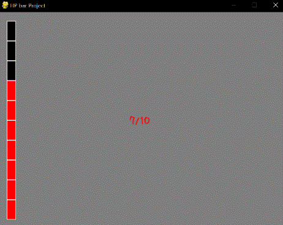

====================================
Author: Youngwook Kim (Korean)
====================================

====================================
Contact: rumia0601@gmail.com
====================================

=========================================
with Advanced PROCESS - Functionalization
=========================================

First, Let’s print visualized geometry, not text. How about HP bar? If max HP of game is fixed and current HP of game can vary from 0 to max HP, what will be simplest way to print both two data?

.. image:: AdvancedOutputProcess1.gif
   :class: inlined-right

.. code-block:: python

   import sys, pygame
   pygame.init()

   size = width, height = 320, 240
   speed = [2, 2]
   black = 0, 0, 0

   screen = pygame.display.set_mode(size)

   ball = pygame.image.load("AdvancedOutputProcess1.gif")
   ballrect = ball.get_rect()

   while True:
       for event in pygame.event.get():
           if event.type == pygame.QUIT: sys.exit()

       ballrect = ballrect.move(speed)
       if ballrect.left < 0 or ballrect.right > width:
           speed[0] = -speed[0]
       if ballrect.top < 0 or ballrect.bottom > height:
           speed[1] = -speed[1]

       screen.fill(black)
       screen.blit(ball, ballrect)
       pygame.display.flip()

.. image:: AdvancedOutputProcess2.gif
   :class: inlined-right

.. code-block:: python

   import sys, pygame
   pygame.init()

   size = width, height = 320, 240
   speed = [2, 2]
   black = 0, 0, 0

   screen = pygame.display.set_mode(size)

   ball = pygame.image.load("AdvancedOutputProcess2.gif")
   ballrect = ball.get_rect()

   while True:
       for event in pygame.event.get():
           if event.type == pygame.QUIT: sys.exit()

       ballrect = ballrect.move(speed)
       if ballrect.left < 0 or ballrect.right > width:
           speed[0] = -speed[0]
       if ballrect.top < 0 or ballrect.bottom > height:
           speed[1] = -speed[1]

       screen.fill(black)
       screen.blit(ball, ballrect)
       pygame.display.flip()

.. image:: AdvancedOutputProcess3.gif
   :class: inlined-right

.. code-block:: python

   import sys, pygame
   pygame.init()

   size = width, height = 320, 240
   speed = [2, 2]
   black = 0, 0, 0

   screen = pygame.display.set_mode(size)

   ball = pygame.image.load("AdvancedOutputProcess3.gif")
   ballrect = ball.get_rect()

   while True:
       for event in pygame.event.get():
           if event.type == pygame.QUIT: sys.exit()

       ballrect = ballrect.move(speed)
       if ballrect.left < 0 or ballrect.right > width:
           speed[0] = -speed[0]
       if ballrect.top < 0 or ballrect.bottom > height:
           speed[1] = -speed[1]

       screen.fill(black)
       screen.blit(ball, ballrect)
       pygame.display.flip()

Yeah, just re-rendering text when certain variable is changed. How to change variable? That logic is inside of Event statement. (Pressing up or down to adjust HP.) Same method as before. But they are still text, which means they are not visualized enough. How to visualize these two data more detail (max HP, current HP)? We can use idea of magazine (gun’s magazine). HP is integer value, which is discrete. So, it can be printed as below:

.. image:: AdvancedOutputProcess4.gif
   :class: inlined-right

.. code-block:: python

   import sys, pygame
   pygame.init()

   size = width, height = 320, 240
   speed = [2, 2]
   black = 0, 0, 0

   screen = pygame.display.set_mode(size)

   ball = pygame.image.load("AdvancedOutputProcess4.gif")
   ballrect = ball.get_rect()

   while True:
       for event in pygame.event.get():
           if event.type == pygame.QUIT: sys.exit()

       ballrect = ballrect.move(speed)
       if ballrect.left < 0 or ballrect.right > width:
           speed[0] = -speed[0]
       if ballrect.top < 0 or ballrect.bottom > height:
           speed[1] = -speed[1]

       screen.fill(black)
       screen.blit(ball, ballrect)
       pygame.display.flip()

.. image:: AdvancedOutputProcess5.gif
   :class: inlined-right

.. code-block:: python

   import sys, pygame
   pygame.init()

   size = width, height = 320, 240
   speed = [2, 2]
   black = 0, 0, 0

   screen = pygame.display.set_mode(size)

   ball = pygame.image.load("AdvancedOutputProcess5.gif")
   ballrect = ball.get_rect()

   while True:
       for event in pygame.event.get():
           if event.type == pygame.QUIT: sys.exit()

       ballrect = ballrect.move(speed)
       if ballrect.left < 0 or ballrect.right > width:
           speed[0] = -speed[0]
       if ballrect.top < 0 or ballrect.bottom > height:
           speed[1] = -speed[1]

       screen.fill(black)
       screen.blit(ball, ballrect)
       pygame.display.flip()

.. code-block:: python

   import sys, pygame
   pygame.init()

   size = width, height = 320, 240
   speed = [2, 2]
   black = 0, 0, 0

   screen = pygame.display.set_mode(size)

   ball = pygame.image.load("AdvancedOutputProcess6.gif")
   ballrect = ball.get_rect()

   while True:
       for event in pygame.event.get():
           if event.type == pygame.QUIT: sys.exit()

       ballrect = ballrect.move(speed)
       if ballrect.left < 0 or ballrect.right > width:
           speed[0] = -speed[0]
       if ballrect.top < 0 or ballrect.bottom > height:
           speed[1] = -speed[1]

       screen.fill(black)
       screen.blit(ball, ballrect)
       pygame.display.flip()

Much better, isn’t it? Drawing logic is inside of #6. Logic is simple, first, draw a **big rectangular** which color is black. Then, check whether draw a **smaller rectangular** which color is red or not depending on current HP. Finally, draw **margin** of current small rectangular. Margin of color is white. We can find there are 4 parameters for location data in ``pygame.draw.rect`` (I mean, third data. First data is canvas data, second data is color data and fourth data is width.) The easiest way to understand 4 parameters is change them. Change one value into 10 or 30 while others are 20! Then it can be understood. Needless to explain.

Furthermore, now it’s time to functionalize specifically. I push Always statement and Event statement into main function. (#7 is needed to find main function and execute it.) And made new function for drawHP. Functionalization idea for game is not far away from that of normal GUI program. For example, it is better to make **single print function for every single value** which has to be displayed. Of course, setting location for each value has to be done while you are designing the screen.

<Reference Code> ::

    import pygame, sys
    from pygame.locals import*
    
    maxHP = 10 
    white = (255,255,255)
    gray = (127,127,127)
    black = (0,0,0)
    red = (255,0,0)
    green = (0,255,0)
    blue = (0,0,255)
    pygame.init()
    pygame.display.set_caption("HP bar Project")
    width = 640 #1
    height = 480 #2
    myScreen = pygame.display.set_mode((width, height))
    myTextFont = pygame.font.Font("HoonWhitecatR.ttf", 32)
    myText = myTextFont.render((str(maxHP) + "/" + str(maxHP)), True, red, gray)
    myTextArea = myText.get_rect()
    myTextArea.center = (width/2, height/2) #3
    fpsClock = pygame.time.Clock()
    
    def main(): #4
        HP = 5
        
        while True:
            myText = myTextFont.render((str(HP) + "/" + str(maxHP)), True, red, gray)
        
            myScreen.fill(gray)
    
            myScreen.blit(myText, myTextArea)
            drawHP(HP) #5
    
            for event in pygame.event.get():
                if event.type == QUIT:
                    pygame.quit()
                    sys.exit()
                elif event.type == KEYDOWN:
                    if event.key == K_UP:
                        if HP != 10:
                            HP = HP + 1
                    elif event.key == K_DOWN:
                        if HP != 0:
                            HP = HP - 1
        
            pygame.display.update()
            fpsClock.tick(60)
    
    def drawHP(HP): #6
        r = int((height - 40) / maxHP)
    
        pygame.draw.rect(myScreen, black, (20, 20, 20, 20 + ((maxHP - 0.5) * r)))
    
        for i in range(maxHP):
            if HP >= (maxHP - i):
                pygame.draw.rect(myScreen, red, (20, 20 + (i * r), 20, r))
            pygame.draw.rect(myScreen, white, (20, 20 + (i * r), 20, r), 1)
    
        return
    
    if __name__ == '__main__': #7
        main()
    