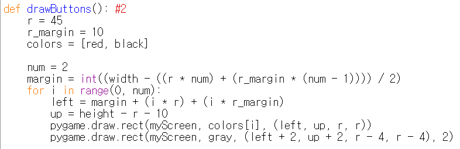

====================================
Author: Youngwook Kim (Korean)
====================================

====================================
Contact: rumia0601@gmail.com
====================================

====================================
with Advanced OUTPUT – Buttons
====================================

Even if KEYDOWN event is used, it seems like this is not entirely GUI game because GUI of this game is only used for output(=print), not input. Input for GUI means caring mouse event for specific location. How about making two buttons to increase or decrease HP?

.. code-block:: python
   :linenos:

   import sys, pygame
   pygame.init()

   size = width, height = 320, 240
   speed = [2, 2]
   black = 0, 0, 0

   screen = pygame.display.set_mode(size)

   ball = pygame.image.load("AdvancedInputOutput1.gif")
   ballrect = ball.get_rect()

   while True:
       for event in pygame.event.get():
           if event.type == pygame.QUIT: sys.exit()

       ballrect = ballrect.move(speed)
       if ballrect.left < 0 or ballrect.right > width:
           speed[0] = -speed[0]
       if ballrect.top < 0 or ballrect.bottom > height:
           speed[1] = -speed[1]

       screen.fill(black)
       screen.blit(ball, ballrect)
       pygame.display.flip()

.. image:: AdvancedInputOutput2.gif
   :class: inlined-right

.. code-block:: python
   :linenos:

   import sys, pygame
   pygame.init()

   size = width, height = 320, 240
   speed = [2, 2]
   black = 0, 0, 0

   screen = pygame.display.set_mode(size)

   ball = pygame.image.load("AdvancedInputOutput2.gif")
   ballrect = ball.get_rect()

   while True:
       for event in pygame.event.get():
           if event.type == pygame.QUIT: sys.exit()

       ballrect = ballrect.move(speed)
       if ballrect.left < 0 or ballrect.right > width:
           speed[0] = -speed[0]
       if ballrect.top < 0 or ballrect.bottom > height:
           speed[1] = -speed[1]

       screen.fill(black)
       screen.blit(ball, ballrect)
       pygame.display.flip()

Okay, making two buttons is simple. Look at the button, they have unique visual shape. How can it be? Simple as previous idea: First, draw **big square**. Second, draw **smaller square** which has small width (this square doesn’t have inner color so color of big square can be displayed) so inner square and outer square seems like separated. But these buttons are still for output only. We need to make click area for this.

.. image:: AdvancedInputOutput3.gif
   :class: inlined-right

.. code-block:: python
   :linenos:

   import sys, pygame
   pygame.init()

   size = width, height = 320, 240
   speed = [2, 2]
   black = 0, 0, 0

   screen = pygame.display.set_mode(size)

   ball = pygame.image.load("AdvancedInputOutput3.gif")
   ballrect = ball.get_rect()

   while True:
       for event in pygame.event.get():
           if event.type == pygame.QUIT: sys.exit()

       ballrect = ballrect.move(speed)
       if ballrect.left < 0 or ballrect.right > width:
           speed[0] = -speed[0]
       if ballrect.top < 0 or ballrect.bottom > height:
           speed[1] = -speed[1]

       screen.fill(black)
       screen.blit(ball, ballrect)
       pygame.display.flip()

.. image:: AdvancedInputOutput4.gif
   :class: inlined-right

.. code-block:: python
   :linenos:

   import sys, pygame
   pygame.init()

   size = width, height = 320, 240
   speed = [2, 2]
   black = 0, 0, 0

   screen = pygame.display.set_mode(size)

   ball = pygame.image.load("AdvancedInputOutput4.gif")
   ballrect = ball.get_rect()

   while True:
       for event in pygame.event.get():
           if event.type == pygame.QUIT: sys.exit()

       ballrect = ballrect.move(speed)
       if ballrect.left < 0 or ballrect.right > width:
           speed[0] = -speed[0]
       if ballrect.top < 0 or ballrect.bottom > height:
           speed[1] = -speed[1]

       screen.fill(black)
       screen.blit(ball, ballrect)
       pygame.display.flip()

.. image:: AdvancedInputOutput5.gif
   :class: inlined-right

.. code-block:: python
   :linenos:

   import sys, pygame
   pygame.init()

   size = width, height = 320, 240
   speed = [2, 2]
   black = 0, 0, 0

   screen = pygame.display.set_mode(size)

   ball = pygame.image.load("AdvancedInputOutput5.gif")
   ballrect = ball.get_rect()

   while True:
       for event in pygame.event.get():
           if event.type == pygame.QUIT: sys.exit()

       ballrect = ballrect.move(speed)
       if ballrect.left < 0 or ballrect.right > width:
           speed[0] = -speed[0]
       if ballrect.top < 0 or ballrect.bottom > height:
           speed[1] = -speed[1]

       screen.fill(black)
       screen.blit(ball, ballrect)
       pygame.display.flip()

Now new event ``MOUSEBUTTONUP`` is added at Event statement. Notice that up of mouse is same as down of key. If MOUSEBUTTONUP is activated, ``event.pos`` will be recorded as x and y. Which means, clicked point. So, determining clicked point is whether inside of certain Rect area or not is needed by checking ``collidepoint``. If inside, it means “**user clicked some point which is part of certain area**” then, adequate process (updating value) is needed.
Notice that there are two area for input:
**(270, 425, 45, 45)** and **(325, 425, 45, 45)** at Event Statement.
Notice that also there are two area for output.
**(margin, height - r -10 , r, r)** and **(margin + r + r_margin, height - r - 10, r, r)** at drawButtons.
In the case of button, input and output area for button must be **identical**. (Otherwise, this button will be deceptive!) It will be best idea to set this data as same value without calculating exact location of function (for output) into constant (for input). There is no specific function to tie this area, so you have to care about this.

<Reference Code> ::

    import pygame, sys
    from pygame.locals import*
    
    maxHP = 10 
    white = (255,255,255)
    gray = (127,127,127)
    black = (0,0,0)
    red = (255,0,0)
    green = (0,255,0)
    blue = (0,0,255)
    pygame.init()
    pygame.display.set_caption("Array buttons Project")
    width = 640 
    height = 480
    myScreen = pygame.display.set_mode((width, height))
    myTextFont = pygame.font.Font("HoonWhitecatR.ttf", 32)
    myText = myTextFont.render((str(maxHP) + "/" + str(maxHP)), True, red, gray)
    myTextArea = myText.get_rect()
    myTextArea.center = (width/2, height/2)
    fpsClock = pygame.time.Clock()
    
    def main():
        HP = 5
        
        while True:
            myText = myTextFont.render((str(HP) + "/" + str(maxHP)), True, red, gray)
        
            myScreen.fill(gray)
    
            myScreen.blit(myText, myTextArea)
            drawHP(HP)
            drawButtons()
    
            for event in pygame.event.get():
                if event.type == QUIT:
                    pygame.quit()
                    sys.exit()
                elif event.type == KEYDOWN:
                    if event.key == K_UP:
                        if HP != 10:
                            HP = HP + 1
                    elif event.key == K_DOWN:
                        if HP != 0:
                            HP = HP - 1
                elif event.type == MOUSEBUTTONUP: #1
                    x, y = event.pos
                    if pygame.Rect(270, 425, 45, 45).collidepoint(x, y):
                        if HP != 10:
                            HP = HP + 1
                    elif pygame.Rect(325, 425, 45, 45).collidepoint(x, y):
                        if HP != 0:
                            HP = HP - 1      
        
            pygame.display.update()
            fpsClock.tick(60)
    
    def drawHP(HP):
        r = int((height - 40) / maxHP)
    
        pygame.draw.rect(myScreen, black, (20, 20, 20, 20 + ((maxHP - 0.5) * r)))
    
        for i in range(maxHP):
            if HP >= (maxHP - i):
                pygame.draw.rect(myScreen, red, (20, 20 + (i * r), 20, r))
            pygame.draw.rect(myScreen, white, (20, 20 + (i * r), 20, r), 1)
    
        return
    
    def drawButtons():
        r = 45
        r_margin = 10
        colors = [red, black]
        
        num = 2
        margin = int((width - ((r * num) + (r_margin * (num - 1)))) / 2)
        for i in range(0, num):
            left = margin + (i * r) + (i * r_margin)
            up = height - r - 10
            pygame.draw.rect(myScreen, colors[i], (left, up, r, r))
            pygame.draw.rect(myScreen, gray, (left + 2, up + 2, r - 4, r - 4), 2)
    
    if __name__ == '__main__':
        main()
    