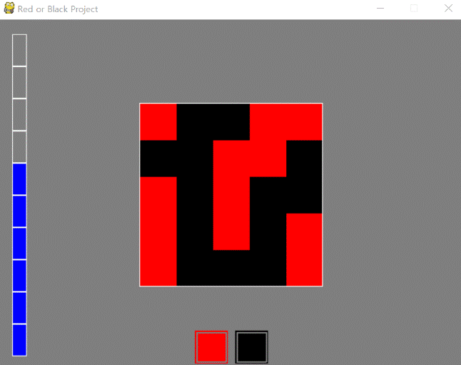

====================================
Author: Youngwook Kim (Korean)
====================================

====================================
Contact: rumia0601@gmail.com
====================================

====================================
and plus alpha
====================================

Actually, everything doesn’t seem like a game. Now, we will insert a rule into this program. Then. It will become game. Rule is simple: counting red or black from 5x5 2D array and choose the color which has much more number! If correct, HP++, otherwise, HP--. Then new array will be set for next quiz! too simple but game which can be made in this tutorial. First, we need to generate 2D array and print it. How? We learned how to print integer data (which equals single data (0D array)) and two buttons (which equals single array (1D array). Case of 2D array just needs one-more step.

.. image:: AdvancedOutputAlpha1.gif
   :class: inlined-right

.. code-block:: python
   :linenos:

   import sys, pygame
   pygame.init()

   size = width, height = 320, 240
   speed = [2, 2]
   black = 0, 0, 0

   screen = pygame.display.set_mode(size)

   ball = pygame.image.load("AdvancedOutputAlpha1.gif")
   ballrect = ball.get_rect()

   while True:
       for event in pygame.event.get():
           if event.type == pygame.QUIT: sys.exit()

       ballrect = ballrect.move(speed)
       if ballrect.left < 0 or ballrect.right > width:
           speed[0] = -speed[0]
       if ballrect.top < 0 or ballrect.bottom > height:
           speed[1] = -speed[1]

       screen.fill(black)
       screen.blit(ball, ballrect)
       pygame.display.flip()

.. image:: AdvancedOutputAlpha2.gif
   :class: inlined-right

.. code-block:: python
   :linenos:

   import sys, pygame
   pygame.init()

   size = width, height = 320, 240
   speed = [2, 2]
   black = 0, 0, 0

   screen = pygame.display.set_mode(size)

   ball = pygame.image.load("AdvancedOutputAlpha2.gif")
   ballrect = ball.get_rect()

   while True:
       for event in pygame.event.get():
           if event.type == pygame.QUIT: sys.exit()

       ballrect = ballrect.move(speed)
       if ballrect.left < 0 or ballrect.right > width:
           speed[0] = -speed[0]
       if ballrect.top < 0 or ballrect.bottom > height:
           speed[1] = -speed[1]

       screen.fill(black)
       screen.blit(ball, ballrect)
       pygame.display.flip()

.. code-block:: python
   :linenos:

   import sys, pygame
   pygame.init()

   size = width, height = 320, 240
   speed = [2, 2]
   black = 0, 0, 0

   screen = pygame.display.set_mode(size)

   ball = pygame.image.load("AdvancedOutputAlpha3.gif")
   ballrect = ball.get_rect()

   while True:
       for event in pygame.event.get():
           if event.type == pygame.QUIT: sys.exit()

       ballrect = ballrect.move(speed)
       if ballrect.left < 0 or ballrect.right > width:
           speed[0] = -speed[0]
       if ballrect.top < 0 or ballrect.bottom > height:
           speed[1] = -speed[1]

       screen.fill(black)
       screen.blit(ball, ballrect)
       pygame.display.flip()

generateboard function returns randomly generated 2D board with the number of red block and black block. Needless to explain. Also, printboard function prints 2D board by same method as 1D array. Output color will be changed by data of board[i][j] is 1 or not. This board is for output only. Processing about margin seems to be annoying because we have to know exact location by calculating. Remember prolog. Output (executing result) of Pygame is GUI but input(coding) of Pygame is CUI. That is Pygame.

Actually, there are a lot of idea for improving this game. How about changing button into image file? How about adding sound effect when previous chose was correct or not? How about setting time limit? How about adding visual effect when player win(maxHP) or not(minHP)? How about make the board bigger with another colors? How about implement Flood-it game by given interface? There are still lots of selection because this game is simple.

<Reference Code> ::

    import pygame, sys, random
    from pygame.locals import*
    
    maxHP = 10 
    white = (255,255,255)
    gray = (127,127,127)
    black = (0,0,0)
    red = (255,0,0)
    green = (0,255,0)
    blue = (0,0,255)
    pygame.init()
    pygame.display.set_caption("Red or Black Project")
    width = 640 
    height = 480
    myScreen = pygame.display.set_mode((width, height))
    myTextFont = pygame.font.Font("HoonWhitecatR.ttf", 32)
    myText = myTextFont.render((str(maxHP) + "/" + str(maxHP)), True, red, gray)
    myTextArea = myText.get_rect()
    myTextArea.center = (width/2, height/2)
    fpsClock = pygame.time.Clock()
    
    def main():
        HP = 5
        board, b_red, b_black = generateBoard(5,5) #1
        
        while True:
            myText = myTextFont.render((str(HP) + "/" + str(maxHP)), True, red, gray)
        
            myScreen.fill(gray)
    
            myScreen.blit(myText, myTextArea)
            drawHP(HP)
            drawButtons()
            drawBoard(board) #2
    
            for event in pygame.event.get():
                if event.type == QUIT:
                    pygame.quit()
                    sys.exit()
                    
                elif event.type == KEYDOWN:
                    if event.key == K_UP:
                        if HP != 10:
                            HP = HP + 1
                    elif event.key == K_DOWN:
                        if HP != 0:
                            HP = HP - 1
                elif event.type == MOUSEBUTTONUP:
                    x, y = event.pos
                    
                    if pygame.Rect(270, 425, 45, 45).collidepoint(x, y): #3
                        if b_red >= b_black:
                            if HP != 10:
                                HP = HP + 1
                            board, b_red, b_black = generateBoard(5,5)
                        elif b_red < b_black:
                            if HP != 0:
                                HP = HP - 1
                            board, b_red, b_black = generateBoard(5,5)
                            
                    elif pygame.Rect(325, 425, 45, 45).collidepoint(x, y): #4
                        if b_red <= b_black:
                            if HP != 10:
                                HP = HP + 1
                            board, b_red, b_black = generateBoard(5,5)
                        elif b_red > b_black:
                            if HP != 0:
                                HP = HP - 1
                            board, b_red, b_black = generateBoard(5,5)
        
            pygame.display.update()
            fpsClock.tick(60)
    
    def drawHP(HP):
        r = int((height - 40) / maxHP)
    
        pygame.draw.rect(myScreen, gray, (20, 20, 20, 20 + ((maxHP - 0.5) * r)))
    
        for i in range(maxHP):
            if HP >= (maxHP - i):
                pygame.draw.rect(myScreen, blue, (20, 20 + (i * r), 20, r))
            pygame.draw.rect(myScreen, white, (20, 20 + (i * r), 20, r), 1)
    
        return
    
    def drawButtons():
        r = 45
        r_margin = 10
        colors = [red, black]
        
        num = 2
        margin = int((width - ((r * num) + (r_margin * (num - 1)))) / 2)
        
        for i in range(0, num):
            left = margin + (i * r) + (i * r_margin)
            up = height - r - 10
            pygame.draw.rect(myScreen, colors[i], (left, up, r, r))
            pygame.draw.rect(myScreen, gray, (left + 2, up + 2, r - 4, r - 4), 2)    
    
    def generateBoard(width, height): #5
        board = []
        b_red = 0
        b_black = 0
        
        for x in range(width):
            column = []
            for y in range(height):
                column.append(random.randint(0, 1))
            board.append(column)
    
        for x in range(width):
            for y in range(height):
                if(board[x][y] == 1):
                     b_red = b_red + 1
                elif(board[x][y] == 0):
                    b_black = b_black + 1
            
        return board, b_red, b_black
    
    def drawBoard(board): #6
        r = 50
        b_width = 5
        b_height = 5
        l_margin = int((width - (b_width * r)) / 2)
        u_margin = int((height - (b_height * r)) / 2)
    
        for x in range(5):
            for y in range(5):
                left = x * r + l_margin
                up = y * r + u_margin
                if board[x][y] == 1:
                    color = red;
                elif board[x][y] == 0:
                    color = black
                pygame.draw.rect(myScreen, color, (left, up, r, r))
                
        left = l_margin
        up = u_margin
        pygame.draw.rect(myScreen, white, (left-1, up-1, r * 5 + 1, r * b_height + 1), 1)
    
    if __name__ == '__main__':
        main()
    