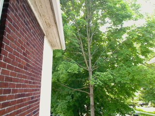
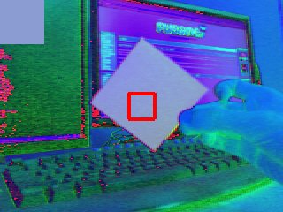
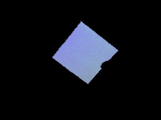
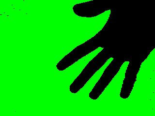
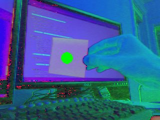

.. TUTORIAL:Introducción al Módulo de Cámara

.. include:: common.txt

****************************************************************
  Pygame Tutorials - Configuración de los Modos de Visualización
****************************************************************

Introducción al Módulo de Cámara
================================

.. rst-class:: docinfo

:Autor: by Nirav Patel
:Contacto: nrp@eclecti.cc

Pygame 1.9 viene con soporte para cámaras interconectadas, lo que le permite capturar
imágenes fijas, ver transmisiones en vivo y hacer algo simple de visión por computadora. Este
tutorial cubrirá todos esos casos de uso, proveyendo ejemplos de código en los que tu puedes basar
tu aplicación o juego. Te puedes referir a  :mod:`reference documentation <pygame.camera>` por el API completo.

.. note::

  Emepezando con Pygame 1.9, el módulo de cámara ofrecera soporte nativo para cámaras 
  que usan v4l2 en Linux. Hay soporte para otras plataformas a través de Videocapture
  u OpenCV, pero esta guía se centrará en el módulo nativo. La mayor parte del código 
  será válido para otras plataformas, pero ciertas cosas como los controles no 
  funcionarán. El módulo también está marcado como **EXPERIMENTAL**, lo que significa 
  que la API podría cambiar en versiones posteriores.

Importar e Init
---------------

::

  import pygame
  import pygame.camera
  from pygame.locals import *

  pygame.init()
  pygame.camera.init()

Ya que el módulo de la cámara es opcional, debe de importarse e inicializarse 
manualmente como se muestra arriba.

Capturar una Sola Imagen
------------------------

Ahora mostraremos el caso más simple de abrir una cámara y capturar un marco como
una superficie. En el siguiente ejemplo, asumimos que hay una cámara en /dev/video0
en la computadora, y la inicializamos con un tamaño de 640 por 480. La superficie 
llamada imagen es lo que la cámara estaba viendo cuando llamamos get_image(). ::

    cam = pygame.camera.Camera("/dev/video0",(640,480))
    cam.start()
    image = cam.get_image()

Listado de Cámaras Conectadas
^^^^^^^^^^^^^^^^^^^^^^^^^^^^^

You may be wondering, what if we don't know the exact path of the camera?
We can ask the module to provide a list of cameras attached to the
computer and initialize the first camera in the list. ::

    camlist = pygame.camera.list_cameras()
    if camlist:
        cam = pygame.camera.Camera(camlist[0],(640,480))

Using Camera Controls
^^^^^^^^^^^^^^^^^^^^^

La mayoría de las cámaras permiten controlar opciones como voltear la imagen y 
cambiar el brillo. set_controls() y get_controls() se pueden usar en cualquier
momento después de usar start(). ::

    cam.set_controls(hflip = True, vflip = False)
    print camera.get_controls()

Captura de una Transmisión en Vivo
----------------------------------

El resto de este tutorial se basará en capturar una transmisión viva de imágenes. 
Para esto, usaremos la siguiente clase. Como describimos, simplemente enviará
un flujo constante de cuadros de cámara a la pantalla, mostrando efectivamente 
video en vivo. Es básicamente lo que esperarias bucle de get_image() haria, 
pasar a la superficie de la pantalla y voltearlo. Por razones de rendimiento, 
proporcionaremos la cámara con la misma superficie cada vez. ::

  class Capture:
      def __init__(self):
          self.size = (640,480)
          # crear una superficie de visualización. cosas estándar de pygame
          self.display = pygame.display.set_mode(self.size, 0)
  
          # esto es lo mismo que vimos antes
          self.clist = pygame.camera.list_cameras()
          if not self.clist:
              raise ValueError("Sorry, no cameras detected.")
          self.cam = pygame.camera.Camera(self.clist[0], self.size)
          self.cam.start()
  
          # crear una superficie para capturar. con fines de rendimiento
          # la profundidad de bits es la misma que la de la superficie de visualización.
          self.snapshot = pygame.surface.Surface(self.size, 0, self.display)
  
      def get_and_flip(self):
          # si no desea vincular la velocidad de fotogramas a la cámara, puedes verificar
          # si la cámara tiene una imagen lista. ten en cuenta que mientras esto funciona
          # en la mayoría de las cámaras, algunas nunca volverán True.
          if self.cam.query_image():
              self.snapshot = self.cam.get_image(self.snapshot)
  
          # blítelo a la superficie de la pantalla. ¡simple!
          self.display.blit(self.snapshot, (0,0))
          pygame.display.flip()
  
      def main(self):
          going = True
          while going:
              events = pygame.event.get()
              for e in events:
                  if e.type == QUIT or (e.type == KEYDOWN and e.key == K_ESCAPE):
                      # cerrar la cámara de forma segura
                      self.cam.stop()
                      going = False
  
              self.get_and_flip()

Dado que get_image() es una llamada de bloqueo que podría tomar bastante tiempo 
en una cámara lenta, este ejemplo usa query_image() para ver si la cámara está lista.
Esto te permite separar la velocidad de fotogramas/framerate de tu juego con la de 
tu cámara. También es posible hacer que la cámara capture imágenes en un subproceso 
separado, con aproximadamente la misma ganancia de rendimiento, si descubres que tu 
cámara no es compatible con la función query_image() correctamente.

Visión Básica de Computadoras 
-----------------------------

Usando los módulos de cámara, transformación y máscara, pygame puede crear 
visión básica de computadoras.

Espacios de Color/Colorspace
^^^^^^^^^^^^^^^^^^^^^^^^^^^^

Al inicializar una cámara, el espacio de color es un parámetro opcional, con 
'RGB', 'YUV' y 'HSV' como opciones posibles. YUV y HSV son generalmente las 
más útiles para la visión por computadora que RGB, y te permiten establecer 
un umbral más fácilmente por color, algo que veremos más adelante en el tutorial.

::

  self.cam = pygame.camera.Camera(self.clist[0], self.size, "RGB")

::

  self.cam = pygame.camera.Camera(self.clist[0], self.size, "YUV")

.. image:: camera_yuv.jpg
   :class: trailing

::

  self.cam = pygame.camera.Camera(self.clist[0], self.size, "HSV")

.. image:: camera_hsv.jpg
   :class: trailing

Umbralización/Thresholding
^^^^^^^^^^^^^^^^^^^^^^^^^^

Usando la función de threshold() del módulo de transformación, uno puede hacer 
simples efectos de pantalla verde o aislar objetos de colores específicos en 
una escena. En el siguiente ejemplo, eliminamos el umbral del árbol verde y 
hacemos que el resto de la imagen sea negra. Consulta la documentación de 
referencia para obtener detalles sobre la función 
:func:`threshold <pygame.transform.threshold>`\ .

::

  self.thresholded = pygame.surface.Surface(self.size, 0, self.display)
  self.snapshot = self.cam.get_image(self.snapshot)
  pygame.transform.threshold(self.thresholded,self.snapshot,(0,255,0),(90,170,170),(0,0,0),2)

.. image:: camera_thresholded.jpg
   :class: trailing

Esto solo es útil si ya sabes exactamente cual es el color del objeto que está buscando.
Para evitar esto y hacer que el umbral sea utilizable en el mundo real, necesitamos
agregar una etapa de calibración en la que identifiquemos el color de un objeto y lo 
usemos como umbral. Usaremos la función average_color() del módulo de transformación 
para hacer esto. A continuación, mostraremos un ejemplo de función de calibración 
que puedes repetir hasta que se produzca un evento, como presionar una tecla, y una
imagen de cómo se vería. El color dentro del cuadro será el que se utilice para el umbral.
Toma en cuenta que estamos utilizando el espacio de color HSV en las siguientes imágenes.

::

  def calibrate(self):
      # capture the image
      self.snapshot = self.cam.get_image(self.snapshot)
      # blit it to the display surface
      self.display.blit(self.snapshot, (0,0))
      # make a rect in the middle of the screen
      crect = pygame.draw.rect(self.display, (255,0,0), (145,105,30,30), 4)
      # get the average color of the area inside the rect
      self.ccolor = pygame.transform.average_color(self.snapshot, crect)
      # fill the upper left corner with that color
      self.display.fill(self.ccolor, (0,0,50,50))
      pygame.display.flip()

::

  pygame.transform.threshold(self.thresholded,self.snapshot,self.ccolor,(30,30,30),(0,0,0),2)

Puedes usar la misma idea para hacer una simple pantalla verde/azul, obteniendo
primero una imagen de fondo y luego aplicando un umbral contra ella. El siguiente
ejemplo solo tiene la cámara apuntando a una pared blanca en el espacio de color HSV.

::

  def calibrate(self):
      # capturar un montón de imágenes de fondo
      bg = []
      for i in range(0,5):
        bg.append(self.cam.get_image(self.background))
      # usa el promedio para deshacersete de parte del ruido
      pygame.transform.average_surfaces(bg,self.background)
      # blit a la superficie de la pantalla
      self.display.blit(self.background, (0,0))
      pygame.display.flip()

.. image:: camera_background.jpg
   :class: trailing

::

  pygame.transform.threshold(self.thresholded,self.snapshot,(0,255,0),(30,30,30),(0,0,0),1,self.background)

Usando el Módulo de Máscara
^^^^^^^^^^^^^^^^^^^^^^^^^^^

Lo anterior es perfecto si simplemente quieres demostrar imágenes, pero con
el :mod:`mask module <pygame.mask>`, también puedes usar una cámara como 
dispositivo de entrada para un juego. Por ejemplo, volviendo al ejemplo de 
umbralizar un objeto específico, podemos encontrar la posición de ese objeto 
y usarlo para controlar un objeto en la pantalla.

::

  def get_and_flip(self):
      self.snapshot = self.cam.get_image(self.snapshot)
      # umbral contra el color que obtuvimos antes
      mask = pygame.mask.from_threshold(self.snapshot, self.ccolor, (30, 30, 30))
      self.display.blit(self.snapshot,(0,0))
      # mantener solo la gota más grande de ese color
      connected = mask.connected_component()
      # asegúrete que la mancha sea lo suficientemente grande para que no sea solo ruido
      if mask.count() > 100:
          # encontrar el centro de la mancha
          coord = mask.centroid()
          # dibuja un círculo con tamaño variable en el tamaño de la mancha
          pygame.draw.circle(self.display, (0,255,0), coord, max(min(50,mask.count()/400),5))
      pygame.display.flip()

Este es solo el ejemplo más básico. Puede rastrear múltiples manchas de diferentes
colores, encontrar los contornos de los objetos, tener detección de colisión entre
la vida real y los objetos del juego, obtener el ángulo de un objeto para permitir
un control aún más preciso y más. ¡Diviertete!
