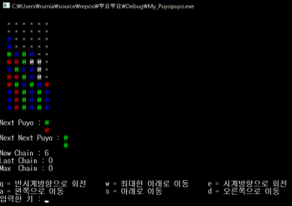
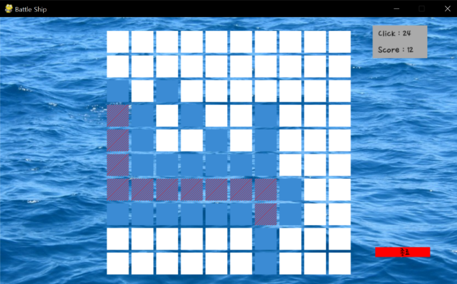

====================================
Author: Youngwook Kim (Korean)
====================================

====================================
Contact: rumia0601@gmail.com
====================================

====================================
프롤로그
====================================

====================================
– 왜 하필 파이게임?
====================================
게임도 프로그램의 일부이기 때문에, 게임은 입력, 처리 그리고 출력으로 구성된다. C 콘솔 환경에서 게임을 만든다고 가정해 보자(C로 소스코드를 작성한 후 콘솔에서 실행하는 방식). 그러면 입력은 수많은 scanf(또는 엔터 입력 필요 없는 비표준 getch) 함수로, 처리는 항상 절차적으로 실행되는 복잡한 알고리즘으로, 출력은 아스키아트를 이용한 printf(그리고 화면을 지우는 깜빡거리는 clear)함수로 구성할 수 있다. 하지만 이렇게 만든 게임은 구식이고, 그래픽 없는 CUI고, 끉겨 보인다는 단점이 있다. 이런 식의 게임을 만드는 것이 질린다면, 보통 Unity 게임엔진이나 Unreal 게임엔진 등 게임 엔진에도 손을 대보게 된다. 하지만, 게임 엔진은 입문장벽이 높다는 단점이 있다. 복소수좌표를 활용한 공간상에서의 충돌, Mechanin/Legacy 애니메이션 호환성, 더 좋은 그래픽을 위한 더 큰 메모리/더 빠른 CPU… 아무래도 콘솔 환경과 게임 엔진 사이에는 딜레마가 있는 것 같다. 이 딜레마를 해결할 수 있을까?

.. code-block:: python
   :linenos:

   import sys, pygame
   pygame.init()

   size = width, height = 220, 140
   speed = [2, 2]
   black = 0, 0, 0

   screen = pygame.display.set_mode(size)

   ball = pygame.image.load("introduction-PuyoPuyo.png")
   ballrect = ball.get_rect()

   while True:
       for event in pygame.event.get():
           if event.type == pygame.QUIT: sys.exit()

       ballrect = ballrect.move(speed)
       if ballrect.left < 0 or ballrect.right > width:
           speed[0] = -speed[0]
       if ballrect.top < 0 or ballrect.bottom > height:
           speed[1] = -speed[1]

       screen.fill(black)
       screen.blit(ball, ballrect)
       pygame.display.flip()

(C 콘솔 환경 게임의 예시 - 뿌요뿌요)

.. image:: introduction-TPS.png
   :class: inlined-right

.. code-block:: python
   :linenos:

   import sys, pygame
   pygame.init()

   size = width, height = 220, 140
   speed = [2, 2]
   black = 0, 0, 0

   screen = pygame.display.set_mode(size)

   ball = pygame.image.load("introduction-TPS.png")
   ballrect = ball.get_rect()

   while True:
       for event in pygame.event.get():
           if event.type == pygame.QUIT: sys.exit()

       ballrect = ballrect.move(speed)
       if ballrect.left < 0 or ballrect.right > width:
           speed[0] = -speed[0]
       if ballrect.top < 0 or ballrect.bottom > height:
           speed[1] = -speed[1]

       screen.fill(black)
       screen.blit(ball, ballrect)
       pygame.display.flip()

(유니티 게임 엔진 게임의 예시- TPS)

다행히 파이게임은 그 딜레마를 해결할 수 있다. 파이게임 이란 프로그래머가 게임을 만들 수 있게 해 주는 파이썬의 외부 라이브러리이다. 파이게임은 콘솔 환경에서의 장점을 가지고 있다. 그 첫째 장점은 하나의 파이게임 프로젝트은 하나의 소스코드와 거의 동치관계라는 것이다. (외부 소리 파일이나 외부 사진 파일을 제외화면) 그래서 프로그래머는 소스 코드를 작성하는 것에만 집중하면 된다. 그리고 둘째 장점은 파이게임은 툴이 아닌 라이브러리이기 때문에, 소스파일에 “import pygame”만 있으면 그 소스파일은 파이게임의 모든 것에 접근할 수 있게 된다. 접근성이 좋다는 것이다. 파이게임은 게임 엔진의 장점도 가지고 있다. 그 첫째 장점은 파이게임이 키보드, 마우스, 파일 등의 상태를 확인하는 입력 관련 함수들과, 도형 그리기, 색 칠하기, 디스플레이 설정 등의 출력 관련 함수들을 제공하기 때문에, CUI가 아닌 GUI 환경에서 실행된다는 것이다. 그리고 둘째 장점은 파이게임이 파이썬에 기반하였기 때문에, 파이게임의 함수들은 절차적이 아닌 이벤트적(여러 함수들이 선택적으로 실행되거나 거의 동시에 실행됨)으로 실행된다는 것이다.

.. code-block:: python
   :linenos:

   import sys, pygame
   pygame.init()

   size = width, height = 220, 140
   speed = [2, 2]
   black = 0, 0, 0

   screen = pygame.display.set_mode(size)

   ball = pygame.image.load("introduction-Battleship.png")
   ballrect = ball.get_rect()

   while True:
       for event in pygame.event.get():
           if event.type == pygame.QUIT: sys.exit()

       ballrect = ballrect.move(speed)
       if ballrect.left < 0 or ballrect.right > width:
           speed[0] = -speed[0]
       if ballrect.top < 0 or ballrect.bottom > height:
           speed[1] = -speed[1]

       screen.fill(black)
       screen.blit(ball, ballrect)
       pygame.display.flip()

(파이게임 게임의 예시- 배틀십)

요약하자면, 파이게임은 저급 수준(콘솔 환경은 예시 중 하나)의 게임 제작 프로그램과 고급 수준(게임 엔진은 예시 중 하나)의 게임 제작 프로그램의 장점을 모두 가진다는 것이다. 파이게임은 이 둘 사이의 좋은 연결점이 된다. 이것이 파이게임을 쓸 이유이다. 더 복잡한 게임 엔진을 최대한 활용해 게임을 만드는 1인 개발자가 목표가 아닌 이상 (빨리 그 게임 엔진을 배우는 것이 낫다!), 콘솔 환경용 게임이 아닌 더 발전된 환경에서 게임을 한번쯤은 코딩해 보고 싶다면 (물론, 푹 빠지면 계속 코딩하게 될 것이다!), 한번쯤은 파이게임을 시도해 볼만 하다.

