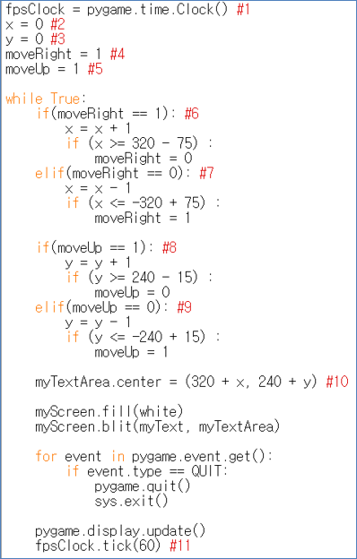

====================================
Author: Youngwook Kim (Korean)
====================================

====================================
Contact: rumia0601@gmail.com
====================================

====================================
기초 처리
====================================

====================================
-화면이 움직이기 위한 조건
====================================
이전 프로젝트는 게임이 아니라 이미지 한 장 같아 보인다. 출력을 바꾸는 입력이나 처리가 없기 때문이다. 물론, 윈도우의 종료 버튼을 누르는 것은 고려되지 않는다 (프로그램을 종료하는 것에 불과하므로). 우선, 우리는 “Hello World!”가 자동적으로 움직이게 할 것이다. 그러면 이제 프로젝트는 이미지 한 장이 아닌 애니메이션 같아 보일 것이다. 어떻게 텍스트를 움직일까? 우리는 텍스트의 위치가 Initial statement에서 초기화됨을 알고 있다. 그렇다면, 이 위치가 Always statement에서 업데이트되게 하면 된다. 물론, 추가적인 변수가 필요할 것이다.

.. code-block:: python
   :linenos:

   import sys, pygame
   pygame.init()

   size = width, height = 220, 140
   speed = [2, 2]
   black = 0, 0, 0

   screen = pygame.display.set_mode(size)

   ball = pygame.image.load("Bagic-PROCESS-sourcecode.png")
   ballrect = ball.get_rect()

   while True:
       for event in pygame.event.get():
           if event.type == pygame.QUIT: sys.exit()

       ballrect = ballrect.move(speed)
       if ballrect.left < 0 or ballrect.right > width:
           speed[0] = -speed[0]
       if ballrect.top < 0 or ballrect.bottom > height:
           speed[1] = -speed[1]

       screen.fill(black)
       screen.blit(ball, ballrect)
       pygame.display.flip()

.. image:: Bagic-PROCESS-resultscreen.png
   :class: inlined-right

.. code-block:: python
   :linenos:

   import sys, pygame
   pygame.init()

   size = width, height = 220, 140
   speed = [2, 2]
   black = 0, 0, 0

   screen = pygame.display.set_mode(size)

   ball = pygame.image.load("Bagic-PROCESS-resultscreen.png")
   ballrect = ball.get_rect()

   while True:
       for event in pygame.event.get():
           if event.type == pygame.QUIT: sys.exit()

       ballrect = ballrect.move(speed)
       if ballrect.left < 0 or ballrect.right > width:
           speed[0] = -speed[0]
       if ballrect.top < 0 or ballrect.bottom > height:
           speed[1] = -speed[1]

       screen.fill(black)
       screen.blit(ball, ballrect)
       pygame.display.flip()

(Moving World 프로젝트의 소스 코드 일부 와 실행 결과)

(Moving World가 알카노이드의 공이나 DVD 화면보호기처럼 움직인다.)

#1 - #5가 Initial문의 뒷부분에 추가되었다. 또한, 다중 if-else문은 Always문의 앞부분에 추가되었고, #11이 Always문의 뒷부분에 추가되었다. #2 - #10이 무엇을 처리하는지는 쉽다. Always문이 시작될 때 Moving World의 좌표에 해당되는 변수를 바꾸고 있다. 하지만 문제가 있다. Moving World는 얼마나 빠를까? Moving World의 변위는 루트2 임은 확실하다. (피타고라스 정리를 이용하면) 하지만 얼마나 자주 Moving World의 변위가 바뀌는가? 이것은 Always문의 시간 복잡도를 분석하지 않는 이상 알아낼 수 없다. (이것은 Always문이 시작하는 빈도에 따라 달라지므로) 그리고 시간 복잡도는 컴퓨터마다 다르다. 그래서 이 시간은 고정될 수 없다.

우리는 이 프로젝트에 고정 속도라는 개념을 추가해야 한다. 어떻게? #1과 #11을 보면, Initial statement에 pygame.time.Clock()함수가, Always문에 tick(60)함수가 있음을 확인할 수 있다. 60이라는 수는 여기서 FPS(Frame Per Second)를 의미한다. FPS가 1초에 화면이 얼마나 자주 바뀌는지를 의미한다. 화면을 바꾸는(업데이트하는) 파이게임의 함수는 무엇인가? 바로 Pygame.display.update() 함수이다. 그러므로, FPS는 1초에 Always문이 실행되는 횟수를 의미하게 된다. 이는 Always문 속에는 단 하나의 Pygame.display.update() 함수가 존재하기 때문이다. FPS는 일종의 선택적인 딜레이 함수와 같은 기능(프로그램 처리 속도에 따라)을 한다, 선택적인 가속 함수가 아니므로, FPS값이 너무 크면 FPS대로 작동하지 않을 수 있다. 우리가 프로젝트 내에서 시간(FPS)을 고정시켜 두면, 특정 게임 오브젝트의 적절한 변위만 찾아내면 그 오브젝트의 속도를 정할 수 있다. pygame.time.Clock()은 게임이 시작되기 이전 속도를 고정시키는 기능을 한다. tick함수는 Pygame.display.update()보다 나중에 와야 한다. 왜냐하면 tick함수는 화면이 몇 번 업데이트되었는지를 계산하기 때문이다. Pygame.display.update() 함수보다 나중에 실행되야 하는 몇 안되는 함수 중 하나이다.

화면이 업데이트 될 때, 시간을 고정하는 방법을 알았다. 정지된 화면보다는 정신없이 움직이는 화면이 게임에선 많으므로, 이를 반드시 알고 있어야 한다. 그러나, 이 프로젝트는 결과가 너무 쉽게 예측되기 때문에 게임이 아닌 것처럼 보인다는 단점은 아직도 있다. (결과를 바꿀 입력이 없으므로) 이젠, 입력 로직이 추가 되어야만 한다.

<참고 코드> ::

    import pygame, sys
    from pygame.locals import*

    white = (255,255,255)
    red = (255,0,0)
    green = (0,255,0)
    pygame.init()
    pygame.display.set_caption("Moving World Project") 
    myScreen = pygame.display.set_mode((640, 480))
    myTextFont = pygame.font.Font("HoonWhitecatR.ttf", 32)
    myText = myTextFont.render("Moving World!", True, red, green) 
    myTextArea = myText.get_rect()
    myTextArea.center = (320, 240)
    fpsClock = pygame.time.Clock() #1
    x = 0 #2
    y = 0 #3
    moveRight = 1 #4
    moveUp= 1 #5

    while True:
        if (moveRight == 1): #6
            x = x + 1
            if (x >= 320 - 75):
                moveRight = 0
        elif (moveRight == 0): #7
            x = x - 1
            if (x <= -320 + 75):
                moveRight = 1

        if (moveUp == 1): #8
            y = y + 1
            if (y >= 240 - 15):
                moveUp = 0
        elif (moveUp == 0): #9
            y = y - 1
            if (y <= -240 + 15):
                moveUp = 1

    myTextArea.center = (320 + x, 240 + y) #10
    
    myScreen.fill(white)
    myScreen.blit(myText, myTextArea)

    for event in pygame.event.get():
        if event.type == QUIT:
            pygame.quit()
            sys.exit()

    pygame.display.update()
    fpsClock.tick(60) #11

