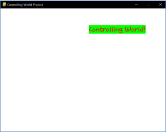

====================================
Author: Youngwook Kim (Korean)
====================================

====================================
Contact: rumia0601@gmail.com
====================================

====================================
기초 입력
====================================

====================================
-새로운 입력은 새로운 이벤트
====================================
생각해보면, 우리는 무언가를 출력하는 방법을 먼저 배우고(“Hello World”를 생각해봐라) 무언가를 입력하는 방법은 나중에 배운다. 왜 그런가? 왜냐면 입력은 몇몇 프로그램에선 필수조건이 아니지만, 출력은 모든 프로그램에선 항상 필수조건이기 때문이다. (프로그램의 정의: 0개 이상의 입력, 1개 이상의 출력) 그러나, 모든 게임은 입력이 필요하다. 그것이 우리는 “나는 게임을 Play한다”라고 말하는 이유이다. Play라는 단어는 몸의 일부분(아마도 손가락)을 움직인다는 뜻이다. 어쨌든, 이 프로젝트가 진짜 게임이 되기 위해 입력 로직을 추가해보자.

.. image:: Bagic-INPUT-sourcecode.png
   :class: inlined-right

.. code-block:: python

   import sys, pygame
   pygame.init()

   size = width, height = 220, 140
   speed = [2, 2]
   black = 0, 0, 0

   screen = pygame.display.set_mode(size)

   ball = pygame.image.load("Bagic-INPUT-sourcecode.png")
   ballrect = ball.get_rect()

   while True:
       for event in pygame.event.get():
           if event.type == pygame.QUIT: sys.exit()

       ballrect = ballrect.move(speed)
       if ballrect.left < 0 or ballrect.right > width:
           speed[0] = -speed[0]
       if ballrect.top < 0 or ballrect.bottom > height:
           speed[1] = -speed[1]

       screen.fill(black)
       screen.blit(ball, ballrect)
       pygame.display.flip()

.. code-block:: python

   import sys, pygame
   pygame.init()

   size = width, height = 220, 140
   speed = [2, 2]
   black = 0, 0, 0

   screen = pygame.display.set_mode(size)

   ball = pygame.image.load("Bagic-INPUT-resultscreen.png")
   ballrect = ball.get_rect()

   while True:
       for event in pygame.event.get():
           if event.type == pygame.QUIT: sys.exit()

       ballrect = ballrect.move(speed)
       if ballrect.left < 0 or ballrect.right > width:
           speed[0] = -speed[0]
       if ballrect.top < 0 or ballrect.bottom > height:
           speed[1] = -speed[1]

       screen.fill(black)
       screen.blit(ball, ballrect)
       pygame.display.flip()

(Controlling World 프로젝트의 소스 코드 일부 와 실행 결과)

(Controlling World가 키보드 방향키를 누르면 해당 방향으로 움직인다.)

이전 프로젝트와 비교하여 2개의 큰 차이점이 생겼다. 첫째는 #5에 KEYDOWN 이벤트가 트리거 되었는지 아닌지를 판단하는 것이다. 다른 줄들은 이전의 알고리즘의 약간 다르게 동작하도록 바꾼 것에 불과하다. 똑같은 명령어가 Event문 앞에 있느냐 뒤에 있느냐 결과는 완전히 달라질 수 있음을 우리는 알고 있다. 좌표를 업데이트하는 경우, Event문이 종료되고 이루어짐에 주목해라. (세팅 된 후 업데이트된다. 그것이 두번째 차이점이다.) 객체 event.key는 키보드에 마지막으로 눌린 키를 의미한다. 구체적인 키의 이름을 보아라. K_UP, K_LEFT, K_DOWN, K_RIGHT. 매우 직관적인 K_시리즈이다. (Header의 pygame.locals로부터 이용할 수 있다.) 다른 키의 이름으로는 K_8, K_a, K_L, K_LCTRL, K_DELETE, L_F4등이 있다. 이런 키들도 추가적인 도움 없이 직관적으로 이해할 수 있다. 모든 키 이름 목록은 https://www.pygame.org/docs/ref/key.html#pygame.key.name 에서 확인할 수 있다.

KEYDOWN은 “이 키는 이전에는 눌리지 않았지만, 지금은 눌렸다.”를 의미하고, “이전부터 지금까지 계속 눌린 채로 있다.”를 의미하지는 않는다. 눌려있는 경우를 다루기 위해서는, KEYUP이라는 이벤트를 추가적으로 확인해야 한다. (변수와 알고리즘이 더 추가된다) 이는 심화 부분에서 다루겠다.

입력을 추가하는 것은 단순히 이벤트 인자를 추가하는 것이기 때문에 쉽다. 이제 게임 프로젝트는 완성되었다. 왜냐하면 프로젝트가 출력, 처리, 입력을 가지고 있기 때문이다. 맞는가? 아니다. 이 프로젝트는 게임 오브젝트간 상호작용이 전혀 없고, 플레이 규칙(제약조건(HP, 시간 등)도 없고 점수도 없다)이 없고, 즐길 것(동기부여 요소, 입력 출력의 다양성, 컨텐츠)이 없기 때문에 게임이라고 불릴 수 없다. 우선, 게임의 인터페이스/시스템을 풍성하게 하기 위해 우리는 심화된 입력(마우스 상태 반영), 처리(적절한 함수화), 출력(이미지, 소리 및 내부 데이터 시각화 방법)을 알아야 한다. 물론, 기초 단계에서의 경험이 반드시 도움이 된다. 심화 단계로 가보자!

<참고 코드> ::

    import pygame, sys
    from pygame.locals import*

    white = (255,255,255)
    red = (255,0,0)
    green = (0,255,0)
    pygame.init()
    pygame.display.set_caption("Controlling World Project") 
    myScreen = pygame.display.set_mode((640, 480))
    myTextFont = pygame.font.Font("HoonWhitecatR.ttf", 32)
    myText = myTextFont.render("Controlling World!", True, red, green) 
    myTextArea = myText.get_rect()
    myTextArea.center = (320, 240)
    fpsClock = pygame.time.Clock()
    x = 0
    y = 0
    moveRight = 0 #1
    moveDown = 0 #2

    while True:
        moveRight = 0 #3
        moveDown = 0 #4
        myTextArea.center = (320 + x, 240 + y)
        myScreen.fill(white)
        myScreen.blit(myText, myTextArea)

        for event in pygame.event.get():
            if event.type == QUIT:
                pygame.quit()
                sys.exit()
            elif event.type == KEYDOWN: #5
                if event.key == K_UP:
                    moveDown = -1
                    moveRight = 0
                elif event.key == K_LEFT:
                    moveDown = 0
                    moveRight = -1
                elif event.key == K_DOWN:
                    moveDown = 1
                    moveRight = 0
                elif event.key == K_RIGHT:
                    moveDown = 0
                    moveRight = 1
                
        if(moveRight == 1): #6
            x = x + 10
        elif(moveRight == -1): #7
            x = x - 10
        if(moveDown == 1): #8
            y = y + 10
        elif(moveDown == -1): #9
            y = y - 10

        pygame.display.update()

