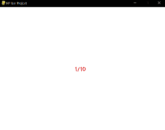
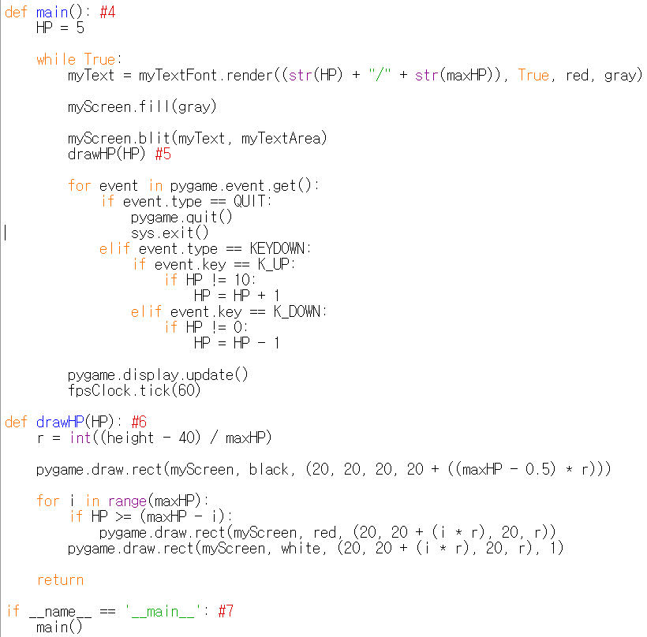

====================================
Author: Youngwook Kim (Korean)
====================================

====================================
Contact: rumia0601@gmail.com
====================================

====================================
그리고 심화 처리 - 함수화
====================================

우선, 텍스트가 아닌, 도형을 시각화 하겠다. HP 바는 어떤가? 만약 HP의 최대값이 고정되어 있고 오직 현재 HP 값만이 변한다면, 이 두 데이터를 출력하는 가장 쉬운 방법은 무엇인가?

.. image:: AdvancedOutputProcess1.gif
   :class: inlined-right

.. code-block:: python
   :linenos:

   import sys, pygame
   pygame.init()

   size = width, height = 320, 240
   speed = [2, 2]
   black = 0, 0, 0

   screen = pygame.display.set_mode(size)

   ball = pygame.image.load("AdvancedOutputProcess1.gif")
   ballrect = ball.get_rect()

   while True:
       for event in pygame.event.get():
           if event.type == pygame.QUIT: sys.exit()

       ballrect = ballrect.move(speed)
       if ballrect.left < 0 or ballrect.right > width:
           speed[0] = -speed[0]
       if ballrect.top < 0 or ballrect.bottom > height:
           speed[1] = -speed[1]

       screen.fill(black)
       screen.blit(ball, ballrect)
       pygame.display.flip()

.. code-block:: python
   :linenos:

   import sys, pygame
   pygame.init()

   size = width, height = 320, 240
   speed = [2, 2]
   black = 0, 0, 0

   screen = pygame.display.set_mode(size)

   ball = pygame.image.load("AdvancedOutputProcess2.gif")
   ballrect = ball.get_rect()

   while True:
       for event in pygame.event.get():
           if event.type == pygame.QUIT: sys.exit()

       ballrect = ballrect.move(speed)
       if ballrect.left < 0 or ballrect.right > width:
           speed[0] = -speed[0]
       if ballrect.top < 0 or ballrect.bottom > height:
           speed[1] = -speed[1]

       screen.fill(black)
       screen.blit(ball, ballrect)
       pygame.display.flip()

.. image:: AdvancedOutputProcess3.gif
   :class: inlined-right

.. code-block:: python
   :linenos:

   import sys, pygame
   pygame.init()

   size = width, height = 320, 240
   speed = [2, 2]
   black = 0, 0, 0

   screen = pygame.display.set_mode(size)

   ball = pygame.image.load("AdvancedOutputProcess3.gif")
   ballrect = ball.get_rect()

   while True:
       for event in pygame.event.get():
           if event.type == pygame.QUIT: sys.exit()

       ballrect = ballrect.move(speed)
       if ballrect.left < 0 or ballrect.right > width:
           speed[0] = -speed[0]
       if ballrect.top < 0 or ballrect.bottom > height:
           speed[1] = -speed[1]

       screen.fill(black)
       screen.blit(ball, ballrect)
       pygame.display.flip()

변수의 값이 변할 때마다 텍스트를 다시 렌더링 하기만 하면 된다. 변수의 값은 어떻게 바꾸는가? 그것은 Event문에서 이루어진다. (키보드 위 또는 아래를 눌러 HP를 조절하게 하였다.) 이전과 동일한 방법이다. 하지만, 이것들은 여전히 텍스트이다. 아직 충분히 시각화 되지 않는다. 이 데이터들을 어떻게 더 상세하게 시각화 할까? 총 탄창에서 아이디어를 따올 수 있다. HP는 정수 값이고, 불연속적 값을 가지므로, 아래와 같이 출력될 수 있다.

.. code-block:: python
   :linenos:

   import sys, pygame
   pygame.init()

   size = width, height = 320, 240
   speed = [2, 2]
   black = 0, 0, 0

   screen = pygame.display.set_mode(size)

   ball = pygame.image.load("AdvancedOutputProcess4.gif")
   ballrect = ball.get_rect()

   while True:
       for event in pygame.event.get():
           if event.type == pygame.QUIT: sys.exit()

       ballrect = ballrect.move(speed)
       if ballrect.left < 0 or ballrect.right > width:
           speed[0] = -speed[0]
       if ballrect.top < 0 or ballrect.bottom > height:
           speed[1] = -speed[1]

       screen.fill(black)
       screen.blit(ball, ballrect)
       pygame.display.flip()

.. image:: AdvancedOutputProcess5.gif
   :class: inlined-right

.. code-block:: python
   :linenos:

   import sys, pygame
   pygame.init()

   size = width, height = 320, 240
   speed = [2, 2]
   black = 0, 0, 0

   screen = pygame.display.set_mode(size)

   ball = pygame.image.load("AdvancedOutputProcess5.gif")
   ballrect = ball.get_rect()

   while True:
       for event in pygame.event.get():
           if event.type == pygame.QUIT: sys.exit()

       ballrect = ballrect.move(speed)
       if ballrect.left < 0 or ballrect.right > width:
           speed[0] = -speed[0]
       if ballrect.top < 0 or ballrect.bottom > height:
           speed[1] = -speed[1]

       screen.fill(black)
       screen.blit(ball, ballrect)
       pygame.display.flip()

.. image:: AdvancedOutputProcess6.gif
   :class: inlined-right

.. code-block:: python
   :linenos:

   import sys, pygame
   pygame.init()

   size = width, height = 320, 240
   speed = [2, 2]
   black = 0, 0, 0

   screen = pygame.display.set_mode(size)

   ball = pygame.image.load("AdvancedOutputProcess6.gif")
   ballrect = ball.get_rect()

   while True:
       for event in pygame.event.get():
           if event.type == pygame.QUIT: sys.exit()

       ballrect = ballrect.move(speed)
       if ballrect.left < 0 or ballrect.right > width:
           speed[0] = -speed[0]
       if ballrect.top < 0 or ballrect.bottom > height:
           speed[1] = -speed[1]

       screen.fill(black)
       screen.blit(ball, ballrect)
       pygame.display.flip()

훨씬 나아졌다. 그리는 로직은 #6을 확인하면 된다. 로직은 단순하다. 먼저, 큰 검은 색 직사각형을 그린다. 그 다음, 현재 HP을 따져서 작은 빨간 색 직사각형들을 0개 또는 최대 개수만큼 그린다. 마지막으로, 작은 직사각형들에 하얀 테두리를 그린다. pygame.draw.rect 함수에선 위치 변수로 4개의 매개 변수가 사용된 것을 확인할 수 있는데 (첫번째 변수는 캔버스 변수이고, 두번째 변수는 색상 변수, 네번째 변수는 두께 변수이다.) 이 4개의 매개 변수의 용도가 무엇인지는 직접 설명하는 것보다, 직접 값을 변경하면서 확인하는 것이 가장 쉽게 이해할 수 있다. 3개의 값이 20일 때 하나의 값 만을 10또는 30으로 바꿔 보아라!

그리고, 이제는 본격적으로 함수화를 해야 한다. Always문과 Event문을 main함수에 담았는데, 이 경우 main함수를 프로그램이 찾을 수 있도록 #7에서 추가적인 처리를 해야 한다. 그 다음 drawHP라는 새로운 함수를 만들었다. 게임에서의 함수화 아이디어는 GUI 프로그램을 만들 때의 함수화 아이디어와 크게 다르지 않다. 예를 들면, 하나의 변수를 출력하는 하나의 출력 함수를 각각 만들어 두는 것이 좋을 것이다. 물론, 각각의 변수가 출력 될 좌표를 정하는 것은 화면 전체를 디자인할 때 선행되어야 할 것이다.

<참고 코드> ::

    import pygame, sys
    from pygame.locals import*
    
    maxHP = 10 
    white = (255,255,255)
    gray = (127,127,127)
    black = (0,0,0)
    red = (255,0,0)
    green = (0,255,0)
    blue = (0,0,255)
    pygame.init()
    pygame.display.set_caption("HP bar Project")
    width = 640 #1
    height = 480 #2
    myScreen = pygame.display.set_mode((width, height))
    myTextFont = pygame.font.Font("HoonWhitecatR.ttf", 32)
    myText = myTextFont.render((str(maxHP) + "/" + str(maxHP)), True, red, gray)
    myTextArea = myText.get_rect()
    myTextArea.center = (width/2, height/2) #3
    fpsClock = pygame.time.Clock()
    
    def main(): #4
        HP = 5
        
        while True:
            myText = myTextFont.render((str(HP) + "/" + str(maxHP)), True, red, gray)
        
            myScreen.fill(gray)
    
            myScreen.blit(myText, myTextArea)
            drawHP(HP) #5
    
            for event in pygame.event.get():
                if event.type == QUIT:
                    pygame.quit()
                    sys.exit()
                elif event.type == KEYDOWN:
                    if event.key == K_UP:
                        if HP != 10:
                            HP = HP + 1
                    elif event.key == K_DOWN:
                        if HP != 0:
                            HP = HP - 1
        
            pygame.display.update()
            fpsClock.tick(60)
    
    def drawHP(HP): #6
        r = int((height - 40) / maxHP)
    
        pygame.draw.rect(myScreen, black, (20, 20, 20, 20 + ((maxHP - 0.5) * r)))
    
        for i in range(maxHP):
            if HP >= (maxHP - i):
                pygame.draw.rect(myScreen, red, (20, 20 + (i * r), 20, r))
            pygame.draw.rect(myScreen, white, (20, 20 + (i * r), 20, r), 1)
    
        return
    
    if __name__ == '__main__': #7
        main()
    