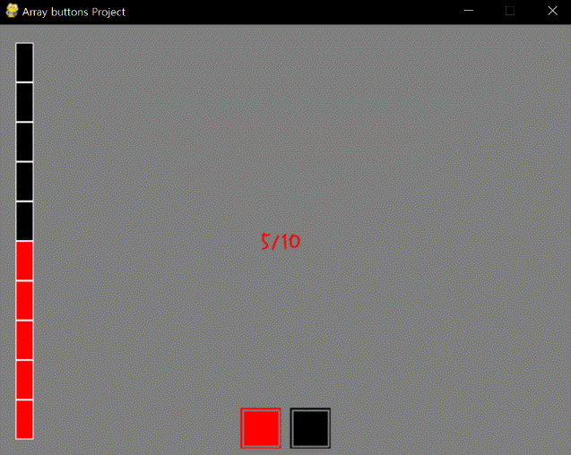
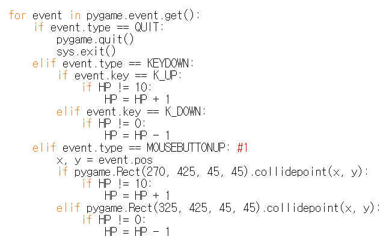
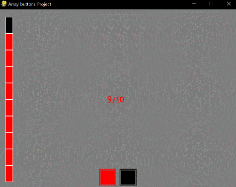
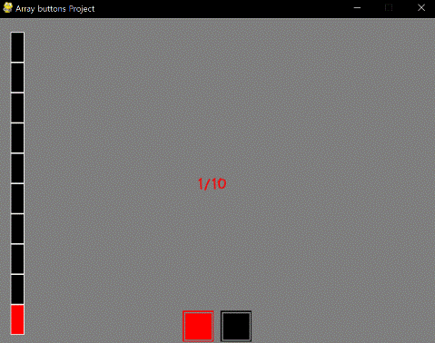

====================================
Author: Youngwook Kim (Korean)
====================================

====================================
Contact: rumia0601@gmail.com
====================================

====================================
그리고 심화 출력 – 버튼
====================================

KEYDOWN이 사용되었지만, 아직도 이 게임이 완전한 GUI가 아닌 것처럼 보이는 이유는 GUI가 입력은 없고 오직 출력(프린트)하는 데에만 사용되었기 때문이다. GUI에서의 입력이란 특정한 위치에서의 마우스 이벤트를 처리하는 것이다. HP를 증가시키거나 감소시키는 버튼 2개를 만드는 것은 어떨까?

.. image:: AdvancedInputOutput1.gif
   :class: inlined-right

.. code-block:: python
   :linenos:

   import sys, pygame
   pygame.init()

   size = width, height = 320, 240
   speed = [2, 2]
   black = 0, 0, 0

   screen = pygame.display.set_mode(size)

   ball = pygame.image.load("AdvancedInputOutput1.gif")
   ballrect = ball.get_rect()

   while True:
       for event in pygame.event.get():
           if event.type == pygame.QUIT: sys.exit()

       ballrect = ballrect.move(speed)
       if ballrect.left < 0 or ballrect.right > width:
           speed[0] = -speed[0]
       if ballrect.top < 0 or ballrect.bottom > height:
           speed[1] = -speed[1]

       screen.fill(black)
       screen.blit(ball, ballrect)
       pygame.display.flip()

.. code-block:: python
   :linenos:

   import sys, pygame
   pygame.init()

   size = width, height = 320, 240
   speed = [2, 2]
   black = 0, 0, 0

   screen = pygame.display.set_mode(size)

   ball = pygame.image.load("AdvancedInputOutput2.gif")
   ballrect = ball.get_rect()

   while True:
       for event in pygame.event.get():
           if event.type == pygame.QUIT: sys.exit()

       ballrect = ballrect.move(speed)
       if ballrect.left < 0 or ballrect.right > width:
           speed[0] = -speed[0]
       if ballrect.top < 0 or ballrect.bottom > height:
           speed[1] = -speed[1]

       screen.fill(black)
       screen.blit(ball, ballrect)
       pygame.display.flip()

버튼 2개를 만드는 것은 쉽다. 버튼을 보면, 뭔가 특이한 효과가 적용되어 있음을 알 수 있다. 어떻게 한 것인가? 이전의 아이디어처럼 단순하다. 첫째, 큰 정사각형을 그린다. 둘째, 내용은 없고 두께만 있는 작은 정사각형을 그린다. 하지만 이 버튼들은 아직 출력용이다. 이 버튼들을 위한 클릭 가능 공간을 만들어야 한다.

.. code-block:: python
   :linenos:

   import sys, pygame
   pygame.init()

   size = width, height = 320, 240
   speed = [2, 2]
   black = 0, 0, 0

   screen = pygame.display.set_mode(size)

   ball = pygame.image.load("AdvancedInputOutput3.gif")
   ballrect = ball.get_rect()

   while True:
       for event in pygame.event.get():
           if event.type == pygame.QUIT: sys.exit()

       ballrect = ballrect.move(speed)
       if ballrect.left < 0 or ballrect.right > width:
           speed[0] = -speed[0]
       if ballrect.top < 0 or ballrect.bottom > height:
           speed[1] = -speed[1]

       screen.fill(black)
       screen.blit(ball, ballrect)
       pygame.display.flip()

.. code-block:: python
   :linenos:

   import sys, pygame
   pygame.init()

   size = width, height = 320, 240
   speed = [2, 2]
   black = 0, 0, 0

   screen = pygame.display.set_mode(size)

   ball = pygame.image.load("AdvancedInputOutput4.gif")
   ballrect = ball.get_rect()

   while True:
       for event in pygame.event.get():
           if event.type == pygame.QUIT: sys.exit()

       ballrect = ballrect.move(speed)
       if ballrect.left < 0 or ballrect.right > width:
           speed[0] = -speed[0]
       if ballrect.top < 0 or ballrect.bottom > height:
           speed[1] = -speed[1]

       screen.fill(black)
       screen.blit(ball, ballrect)
       pygame.display.flip()

.. code-block:: python
   :linenos:

   import sys, pygame
   pygame.init()

   size = width, height = 320, 240
   speed = [2, 2]
   black = 0, 0, 0

   screen = pygame.display.set_mode(size)

   ball = pygame.image.load("AdvancedInputOutput5.gif")
   ballrect = ball.get_rect()

   while True:
       for event in pygame.event.get():
           if event.type == pygame.QUIT: sys.exit()

       ballrect = ballrect.move(speed)
       if ballrect.left < 0 or ballrect.right > width:
           speed[0] = -speed[0]
       if ballrect.top < 0 or ballrect.bottom > height:
           speed[1] = -speed[1]

       screen.fill(black)
       screen.blit(ball, ballrect)
       pygame.display.flip()

이제 Event문에 MOUSEBUTTONUP이 추가되었다. 마우스가 UP 된 것은 키보드가 DOWN된 것과 동일한 의미를 가진다. 만약 MOUSEBUTTONUP이 활성화되면, event.pos는 x값과 y값을 기록해야 하는데, 이 것은 클릭 지점을 나타낸다. 그러므로, 클릭이 특정 정사각형 내부에서 일어났는지 아닌 지는 collidepoint를 확인하면 된다. 만약 내부였다면, “사용자가 특정 영역 내부를 클릭했다”를 의미하게 된다. 그 다음, 변수를 업데이트하는 적절한 처리만이 필요하게 된다.
입력을 위한 두 변수가 존재하고, (Event문에 있음)
(270, 425, 45, 45)와 (325, 425, 45, 45).
출력을 위한 두 변수도 존재함을 확인하라. (drawButtons에 있음)
(margin, height - r -10 , r, r)과 (margin + r + r_margin, height - r - 10, r, r).
버튼의 경우, 입력 영역과 출력 영역이 동일해야 한다. 그렇지 않다면, 버튼의 판정 범위는 오해의 소지가 될 수 있다! 변수(출력 용)들을 구체적인 계산을 통해 상수(입력 용) 값을 알아내기 싫다면, 이 변수들을 동일한 변수로 두는 것이 좋은 생각일 것이다. 두 영역을 하나로 묶을 수 있는 함수는 없으므로, 이 점은 항상 신경 써야 한다.

<참고 코드> ::

    import pygame, sys
    from pygame.locals import*
    
    maxHP = 10 
    white = (255,255,255)
    gray = (127,127,127)
    black = (0,0,0)
    red = (255,0,0)
    green = (0,255,0)
    blue = (0,0,255)
    pygame.init()
    pygame.display.set_caption("Array buttons Project")
    width = 640 
    height = 480
    myScreen = pygame.display.set_mode((width, height))
    myTextFont = pygame.font.Font("HoonWhitecatR.ttf", 32)
    myText = myTextFont.render((str(maxHP) + "/" + str(maxHP)), True, red, gray)
    myTextArea = myText.get_rect()
    myTextArea.center = (width/2, height/2)
    fpsClock = pygame.time.Clock()
    
    def main():
        HP = 5
        
        while True:
            myText = myTextFont.render((str(HP) + "/" + str(maxHP)), True, red, gray)
        
            myScreen.fill(gray)
    
            myScreen.blit(myText, myTextArea)
            drawHP(HP)
            drawButtons()
    
            for event in pygame.event.get():
                if event.type == QUIT:
                    pygame.quit()
                    sys.exit()
                elif event.type == KEYDOWN:
                    if event.key == K_UP:
                        if HP != 10:
                            HP = HP + 1
                    elif event.key == K_DOWN:
                        if HP != 0:
                            HP = HP - 1
                elif event.type == MOUSEBUTTONUP: #1
                    x, y = event.pos
                    if pygame.Rect(270, 425, 45, 45).collidepoint(x, y):
                        if HP != 10:
                            HP = HP + 1
                    elif pygame.Rect(325, 425, 45, 45).collidepoint(x, y):
                        if HP != 0:
                            HP = HP - 1      
        
            pygame.display.update()
            fpsClock.tick(60)
    
    def drawHP(HP):
        r = int((height - 40) / maxHP)
    
        pygame.draw.rect(myScreen, black, (20, 20, 20, 20 + ((maxHP - 0.5) * r)))
    
        for i in range(maxHP):
            if HP >= (maxHP - i):
                pygame.draw.rect(myScreen, red, (20, 20 + (i * r), 20, r))
            pygame.draw.rect(myScreen, white, (20, 20 + (i * r), 20, r), 1)
    
        return
    
    def drawButtons():
        r = 45
        r_margin = 10
        colors = [red, black]
        
        num = 2
        margin = int((width - ((r * num) + (r_margin * (num - 1)))) / 2)
        for i in range(0, num):
            left = margin + (i * r) + (i * r_margin)
            up = height - r - 10
            pygame.draw.rect(myScreen, colors[i], (left, up, r, r))
            pygame.draw.rect(myScreen, gray, (left + 2, up + 2, r - 4, r - 4), 2)
    
    if __name__ == '__main__':
        main()
    