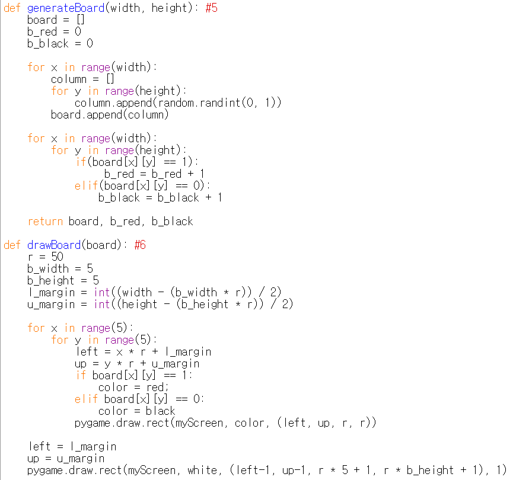

====================================
Author: Youngwook Kim (Korean)
====================================

====================================
Contact: rumia0601@gmail.com
====================================

====================================
그리고 조금 더!
====================================

사실, 모든 것들이 게임 같아 보이진 않는다. 이제, 이 프로그램에 규칙을 추가하려 한다. 그러면, 이 프로그램은 게임이 된다. 규칙은 간단하다: 5x5 2차원 배열에서 빨간 블록, 검은 블록의 수를 세고, 더 많은 색상의 블록을 고르는 것이다! 정답이라면 HP는 증가하고 오답이라면, HP는 감소한다. 그 다음, 다음 문제를 위한 새로운 2차원 배열이 그려진다! 대단히 단순하지만 이 튜토리얼 내에서 만들어 질 수 있는 게임이다. 우선, 2차원 배열을 만들고 출력해야 한다. 어떻게? 우리는 정수 데이터(0차원 배열과 같음)나 두 버튼(1차원 배열과 같음)을 출력하는 법을 알 고 있다. 2차원 배열은 요소 하나만 더 추가되면 된다.

.. code-block:: python
   :linenos:

   import sys, pygame
   pygame.init()

   size = width, height = 320, 240
   speed = [2, 2]
   black = 0, 0, 0

   screen = pygame.display.set_mode(size)

   ball = pygame.image.load("AdvancedOutputAlpha1.gif")
   ballrect = ball.get_rect()

   while True:
       for event in pygame.event.get():
           if event.type == pygame.QUIT: sys.exit()

       ballrect = ballrect.move(speed)
       if ballrect.left < 0 or ballrect.right > width:
           speed[0] = -speed[0]
       if ballrect.top < 0 or ballrect.bottom > height:
           speed[1] = -speed[1]

       screen.fill(black)
       screen.blit(ball, ballrect)
       pygame.display.flip()

.. image:: AdvancedOutputAlpha2.gif
   :class: inlined-right

.. code-block:: python
   :linenos:

   import sys, pygame
   pygame.init()

   size = width, height = 320, 240
   speed = [2, 2]
   black = 0, 0, 0

   screen = pygame.display.set_mode(size)

   ball = pygame.image.load("AdvancedOutputAlpha2.gif")
   ballrect = ball.get_rect()

   while True:
       for event in pygame.event.get():
           if event.type == pygame.QUIT: sys.exit()

       ballrect = ballrect.move(speed)
       if ballrect.left < 0 or ballrect.right > width:
           speed[0] = -speed[0]
       if ballrect.top < 0 or ballrect.bottom > height:
           speed[1] = -speed[1]

       screen.fill(black)
       screen.blit(ball, ballrect)
       pygame.display.flip()

.. image:: AdvancedOutputAlpha3.gif
   :class: inlined-right

.. code-block:: python
   :linenos:

   import sys, pygame
   pygame.init()

   size = width, height = 320, 240
   speed = [2, 2]
   black = 0, 0, 0

   screen = pygame.display.set_mode(size)

   ball = pygame.image.load("AdvancedOutputAlpha3.gif")
   ballrect = ball.get_rect()

   while True:
       for event in pygame.event.get():
           if event.type == pygame.QUIT: sys.exit()

       ballrect = ballrect.move(speed)
       if ballrect.left < 0 or ballrect.right > width:
           speed[0] = -speed[0]
       if ballrect.top < 0 or ballrect.bottom > height:
           speed[1] = -speed[1]

       screen.fill(black)
       screen.blit(ball, ballrect)
       pygame.display.flip()

generateboard 함수는 무작위로 만들어진 2차원 배열과 빨간 블록, 검은 블록의 개수를 반환한다. 더 설명할 필요도 없다. 또한, printboard 함수는 1차원 배열처럼 2차원 배열을 출력한다. 출력 색상은 board[i][j]가 1인지 아닌 지에 따라 달라진다. 이 게임판은 단순히 출력 용이다. 테두리를 처리하려면 부분의 크기를 가지고 전체 크기를 계산해야 해서 짜증날 수 있다. 이것은 프롤로그에서 언급한 대로, 파이게임 갖는 특성 (실행 결과는 GUI이지만 코드 작성은 CUI) 때문이다.

사실, 이 구현한 게임은 개선의 여지가 많다. 버튼을 이미지 파일로 바꾸면? 정답이거나 오답일 때 효과음을 넣으면? 시간 제한을 넣으면? 정답이거나 오답일 때 시각적 효과를 넣으면? 게임판을 더 크게 하고 색상을 더 다양히 넣는다면? 이 인터페이스를 가지고 Flood-it을 구현한다면? 구현한 게임이 단순하기 때문에 선택지는 많다.

<참고 코드> ::

    import pygame, sys, random
    from pygame.locals import*
    
    maxHP = 10 
    white = (255,255,255)
    gray = (127,127,127)
    black = (0,0,0)
    red = (255,0,0)
    green = (0,255,0)
    blue = (0,0,255)
    pygame.init()
    pygame.display.set_caption("Red or Black Project")
    width = 640 
    height = 480
    myScreen = pygame.display.set_mode((width, height))
    myTextFont = pygame.font.Font("HoonWhitecatR.ttf", 32)
    myText = myTextFont.render((str(maxHP) + "/" + str(maxHP)), True, red, gray)
    myTextArea = myText.get_rect()
    myTextArea.center = (width/2, height/2)
    fpsClock = pygame.time.Clock()
    
    def main():
        HP = 5
        board, b_red, b_black = generateBoard(5,5) #1
        
        while True:
            myText = myTextFont.render((str(HP) + "/" + str(maxHP)), True, red, gray)
        
            myScreen.fill(gray)
    
            myScreen.blit(myText, myTextArea)
            drawHP(HP)
            drawButtons()
            drawBoard(board) #2
    
            for event in pygame.event.get():
                if event.type == QUIT:
                    pygame.quit()
                    sys.exit()
                    
                elif event.type == KEYDOWN:
                    if event.key == K_UP:
                        if HP != 10:
                            HP = HP + 1
                    elif event.key == K_DOWN:
                        if HP != 0:
                            HP = HP - 1
                elif event.type == MOUSEBUTTONUP:
                    x, y = event.pos
                    
                    if pygame.Rect(270, 425, 45, 45).collidepoint(x, y): #3
                        if b_red >= b_black:
                            if HP != 10:
                                HP = HP + 1
                            board, b_red, b_black = generateBoard(5,5)
                        elif b_red < b_black:
                            if HP != 0:
                                HP = HP - 1
                            board, b_red, b_black = generateBoard(5,5)
                            
                    elif pygame.Rect(325, 425, 45, 45).collidepoint(x, y): #4
                        if b_red <= b_black:
                            if HP != 10:
                                HP = HP + 1
                            board, b_red, b_black = generateBoard(5,5)
                        elif b_red > b_black:
                            if HP != 0:
                                HP = HP - 1
                            board, b_red, b_black = generateBoard(5,5)
        
            pygame.display.update()
            fpsClock.tick(60)
    
    def drawHP(HP):
        r = int((height - 40) / maxHP)
    
        pygame.draw.rect(myScreen, gray, (20, 20, 20, 20 + ((maxHP - 0.5) * r)))
    
        for i in range(maxHP):
            if HP >= (maxHP - i):
                pygame.draw.rect(myScreen, blue, (20, 20 + (i * r), 20, r))
            pygame.draw.rect(myScreen, white, (20, 20 + (i * r), 20, r), 1)
    
        return
    
    def drawButtons():
        r = 45
        r_margin = 10
        colors = [red, black]
        
        num = 2
        margin = int((width - ((r * num) + (r_margin * (num - 1)))) / 2)
        
        for i in range(0, num):
            left = margin + (i * r) + (i * r_margin)
            up = height - r - 10
            pygame.draw.rect(myScreen, colors[i], (left, up, r, r))
            pygame.draw.rect(myScreen, gray, (left + 2, up + 2, r - 4, r - 4), 2)    
    
    def generateBoard(width, height): #5
        board = []
        b_red = 0
        b_black = 0
        
        for x in range(width):
            column = []
            for y in range(height):
                column.append(random.randint(0, 1))
            board.append(column)
    
        for x in range(width):
            for y in range(height):
                if(board[x][y] == 1):
                     b_red = b_red + 1
                elif(board[x][y] == 0):
                    b_black = b_black + 1
            
        return board, b_red, b_black
    
    def drawBoard(board): #6
        r = 50
        b_width = 5
        b_height = 5
        l_margin = int((width - (b_width * r)) / 2)
        u_margin = int((height - (b_height * r)) / 2)
    
        for x in range(5):
            for y in range(5):
                left = x * r + l_margin
                up = y * r + u_margin
                if board[x][y] == 1:
                    color = red;
                elif board[x][y] == 0:
                    color = black
                pygame.draw.rect(myScreen, color, (left, up, r, r))
                
        left = l_margin
        up = u_margin
        pygame.draw.rect(myScreen, white, (left-1, up-1, r * 5 + 1, r * b_height + 1), 1)
    
    if __name__ == '__main__':
        main()
    